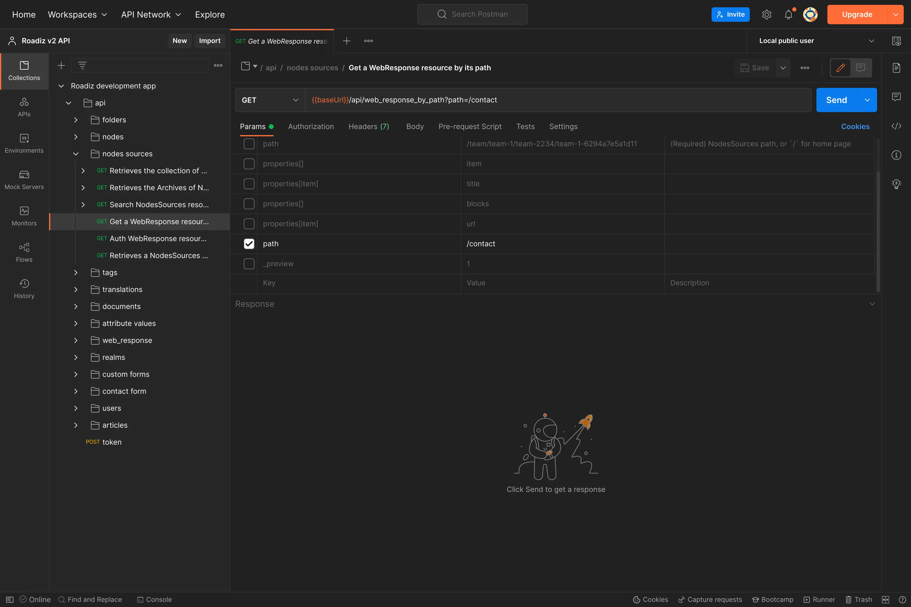

# Building headless websites using API

Since Roadiz v2, headless development is default and is the most powerful way to build reactive websites and applications.
Roadiz is built on [API Platform](https://api-platform.com/), and it exposes all main entities as API Resources using [DTO (data transfer objects)](https://api-platform.com/docs/core/dto/#using-data-transfer-objects-dtos)

We recommend using [Rezo Zero Nuxt starter](https://github.com/rezozero/nuxt-starter) to build your frontend applications. This starter is built to use Roadiz API and relies on dynamic routing and supports API redirections.
