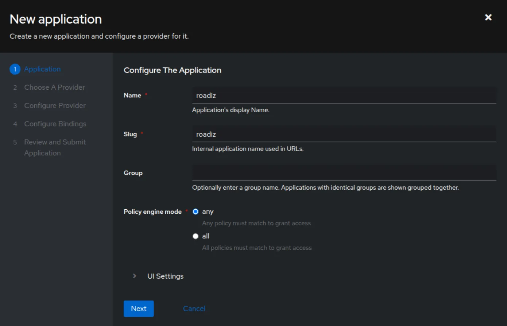
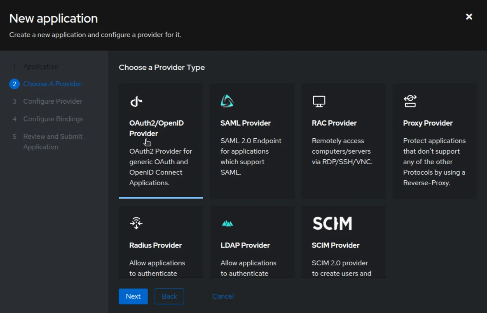
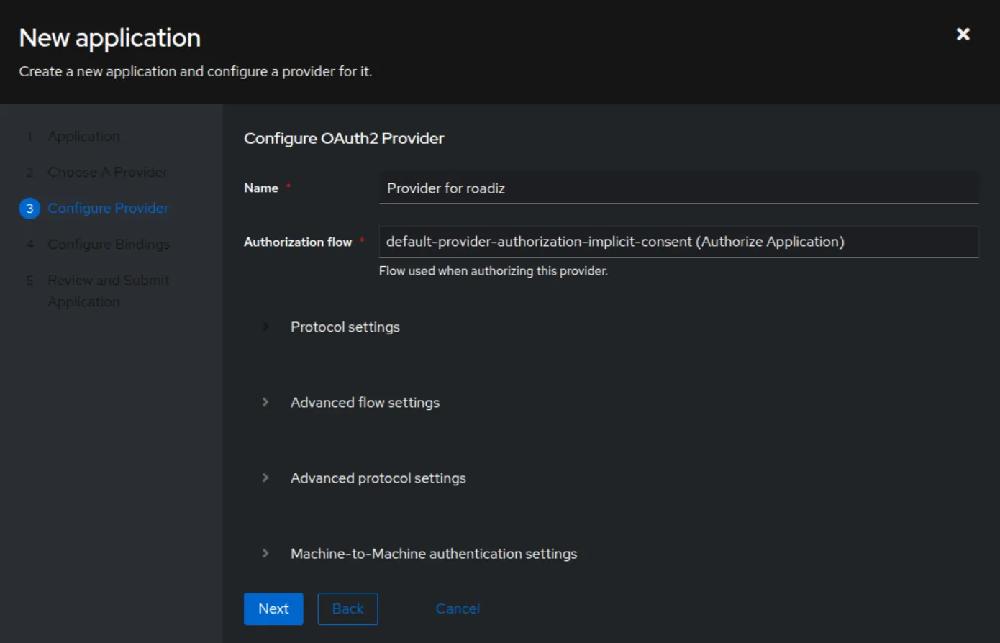
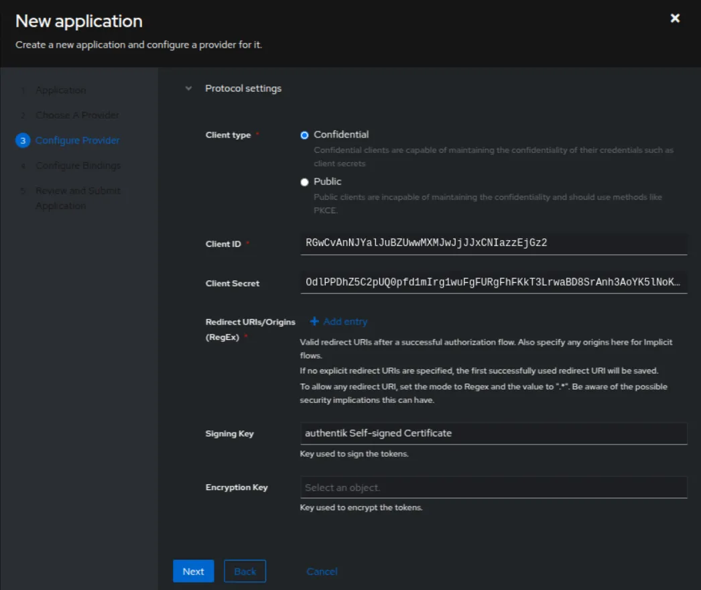
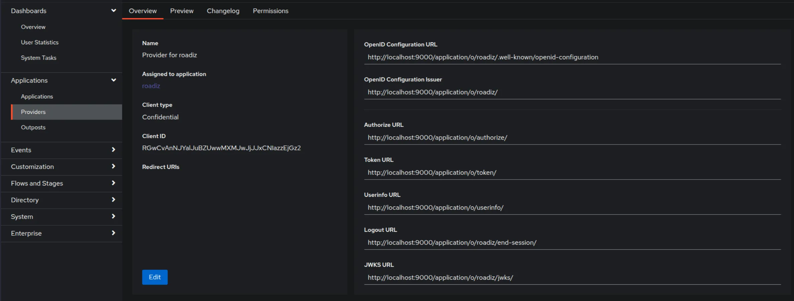
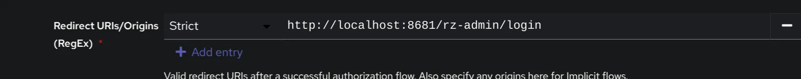
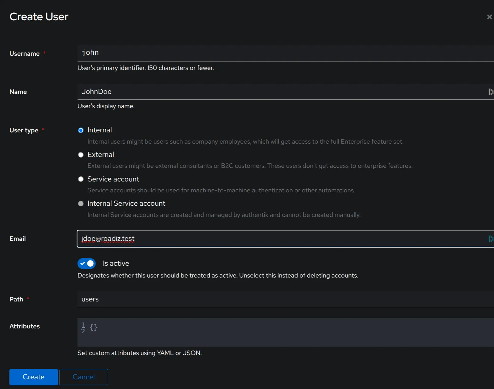
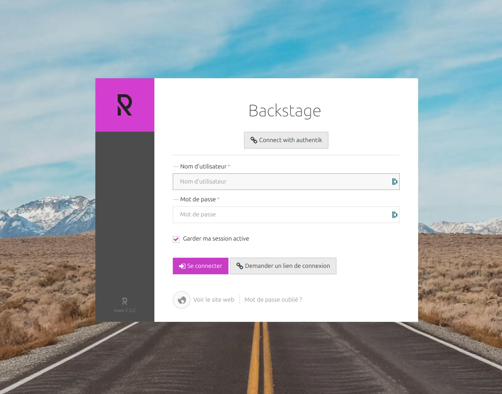

# Configuration

Roadiz is a full-stack Symfony application. It follows its configuration scheme as described in
[Symfony Configuration](https://symfony.com/doc/6.4/configuration.html).

## Choose your database inheritance model

*Roadiz*'s main feature is its polymorphic data model, mapped to a relational database.
This structure can cause performance bottlenecks when dealing with more than 20-30 node types.
To address this, we made the data inheritance model configurable.

Roadiz defaults to [
`single_table`](https://www.doctrine-project.org/projects/doctrine-orm/en/3.3/reference/inheritance-mapping.html#single-table-inheritance)
mode for better performances with many node-types.
However, this model does not support fields with the *same name but different types* since all node-type fields are
stored in the **same SQL table**.
Single table inheritance is the best option when you fetch different node-sources as the same time (for page blocks).

::: tip
In `single_table` mode, you can optimize your performances but reusing field `name` across node-types whenever possible.
This will keep your columns count low and your queries fast.
:::

For mixed field types, you can switch to [
`joined`](https://www.doctrine-project.org/projects/doctrine-orm/en/3.3/reference/inheritance-mapping.html#class-table-inheritance)
inheritance type.
This model is better with a small number of node-types (max. 20) but with very different fields. It requires *LEFT JOIN*
operations
on each node-source query unless a node-type criterion is specified.
Joined table inheritance is a better option when you always fetch node-sources of the same type (for example, a list of
articles).

Configure *Doctrine* strategy in `config/packages/roadiz_core.yaml`:

```yaml
roadiz_core:
    inheritance:
        # type: joined
        type: single_table
```

- **Joined class inheritance**: `joined`
- **Single table inheritance**: `single_table`

::: warning
Changing this setting after content creation will **erase all node-source data**.
:::

## Configure a captcha service for custom forms and POST API endpoints

Roadiz supports captcha verification provided by:

- [Google reCAPTCHA](https://www.google.com/recaptcha)
- [Friendly CAPTCHA](https://www.friendlycaptcha.eu)
- [hCaptcha](https://docs.hcaptcha.com/)
- [Cloudflare Turnstile](https://developers.cloudflare.com/turnstile/get-started/client-side-rendering/)

Roadiz will automatically use the configured captcha service based on `roadiz_core.captcha.verify_url` value.

```yaml
roadiz_core:
    captcha:
        private_key: '%env(string:APP_CAPTCHA_PRIVATE_KEY)%'
        public_key: '%env(string:APP_CAPTCHA_PUBLIC_KEY)%'
        verify_url: '%env(string:APP_CAPTCHA_VERIFY_URL)%'
```

If you change `APP_CAPTCHA_VERIFY_URL` environment variable, you need to clear Symfony cache to apply the new
configuration.

Then you can use the `withCaptcha()` method on your contact-form manager to add a captcha field to your form.
Or inject the `RZ\Roadiz\CoreBundle\Captcha\CaptchaServiceInterface` in your own logic to verify the captcha response.

You can check which captcha service is currently configured by running the following command:

```shell
bin/console debug:container CaptchaServiceInterface

# Example output:
Information for Service "RZ\Roadiz\CoreBundle\Captcha\CaptchaServiceInterface"
==============================================================================

 ---------------- ------------------------------------------------------------ 
  Option           Value                                                       
 ---------------- ------------------------------------------------------------ 
  Service ID       RZ\Roadiz\CoreBundle\Captcha\CaptchaServiceInterface        
  Class            RZ\Roadiz\CoreBundle\Captcha\TurnstileCaptchaService        
  Tags             -                                                           
  Public           yes                                                         
  Synthetic        no                                                          
  Lazy             no                                                          
  Shared           yes                                                         
  Abstract         no                                                          
  Autowired        no                                                          
  Autoconfigured   no                                                          
  Usages           RZ\Roadiz\CoreBundle\Form\CaptchaType                       
                   RZ\Roadiz\CoreBundle\Form\Constraint\CaptchaValidator       
                   RZ\Roadiz\CoreBundle\Form\CustomFormsType                   
                   RZ\Roadiz\CoreBundle\Mailer\ContactFormManagerFactory           
 ---------------- ------------------------------------------------------------ 
```

### Default captcha service verification URLs

- **Google reCAPTCHA**: `https://www.google.com/recaptcha/api/siteverify`
- **Friendly CAPTCHA**: `https://global.frcapi.com/api/v2/captcha/siteverify`
- **hCaptcha**: `https://hcaptcha.com/siteverify`
- **Cloudflare Turnstile**: `https://challenges.cloudflare.com/turnstile/v0/siteverify`

### API endpoints captcha verification

Protected API endpoints can be configured to require captcha verification such as `POST` requests to custom-forms. If
JSON form responses includes
one of the following keys in `required` property, Roadiz will automatically verify the captcha response against the
configured captcha service:

- `frc-captcha-response`
- `h-captcha-response`
- `g-recaptcha-response`
- `cf-turnstile-response`

## Reverse Proxy Cache Invalidation

Roadiz supports cache invalidation for both external (e.g., *Varnish*) and internal (*Symfony* AppCache) reverse
proxies.
When the back-office cache is cleared, Roadiz sends a `BAN` request. For node-source updates, a `PURGE` request is sent
using the first reachable node-source URL.

### Varnish Configuration

```yaml
roadiz_core:
    reverseProxyCache:
        frontend:
            default:
                host: '%env(string:VARNISH_HOST)%'
                domainName: '%env(string:VARNISH_DOMAIN)%'
```

To ensure proper cache handling, configure your external reverse proxy:
[Reverse Proxy Configuration](https://github.com/roadiz/roadiz/blob/develop/samples/varnish_default.vcl).

### API Platform Invalidation

For API Platform, configure `http_cache`:

```yaml
api_platform:
    http_cache:
        invalidation:
            enabled: true
            varnish_urls: [ '%env(VARNISH_URL)%' ]
```

### Cloudflare Proxy Cache

Roadiz can send purge requests to Cloudflare. Collect the following information:

- Cloudflare zone identifier
- Cloudflare API credentials (Bearer token or email + auth-key)

**Using Bearer token:**

```yaml
roadiz_core:
    reverseProxyCache:
        frontend: [ ]
        cloudflare:
            zone: cloudflare-zone
            bearer: ~
```

**Using Email and AuthKey:**

```yaml
roadiz_core:
    reverseProxyCache:
        frontend: [ ]
        cloudflare:
            zone: cloudflare-zone
            email: ~
            key: ~
```

## Entities Paths

Roadiz uses *Doctrine* to map object entities to database tables. Example configuration:

```yaml
doctrine:
    dbal:
        url: '%env(resolve:DATABASE_URL)%'
    orm:
        default_entity_manager: default
        entity_managers:
            default:
                mappings:
                    App:
                        is_bundle: false
                        type: attribute
                        dir: '%kernel.project_dir%/src/Entity'
                        prefix: 'App\Entity'
                        alias: App
```

::: info
Always use `type: attribute` as Doctrine annotations support has been dropped on Symfony 7.3+.
:::

## Configure Mailer

Roadiz uses *Symfony Mailer* for email handling.
[Symfony Mailer Setup](https://symfony.com/doc/6.4/mailer.html#transport-setup)

```yaml
# config/packages/mailer.yaml
framework:
    mailer:
        dsn: '%env(MAILER_DSN)%'
        # Mailer Envelope configuration
        envelope:
            sender: '%env(string:MAILER_ENVELOP_SENDER)%'
```

```dotenv
# .env.local
###> symfony/mailer ###
MAILER_DSN=smtp://mailer:1025
MAILER_ENVELOP_SENDER="Roadiz Dev Website<roadiz-core-app@roadiz.io>"
###< symfony/mailer ###
```

::: tip
Check that your envelope sender address is from a validated domain (i.e. SPF, DKIM) to avoid being blacklisted.
:::

## Image Processing

Roadiz integrates with [Intervention Request Bundle](https://github.com/rezozero/intervention-request-bundle) for
automatic image resizing and optimization.

```yaml
rz_intervention_request:
    driver: '%env(IR_DRIVER)%'
    default_quality: '%env(int:IR_DEFAULT_QUALITY)%'
    max_pixel_size: '%env(int:IR_MAX_PIXEL_SIZE)%'
    cache_path: "%kernel.project_dir%/public/assets"
    files_path: "%kernel.project_dir%/public/files"
    jpegoptim_path: /usr/bin/jpegoptim
    pngquant_path: /usr/bin/pngquant
    subscribers: [ ]
```

### Kraken.io Integration

```yaml
rz_intervention_request:
    subscribers:
        -   class: "AM\\InterventionRequest\\Listener\\KrakenListener"
            args:
                - "your-api-key"
                - "your-api-secret"
                - true
```

::: warning
Each generated image is sent to *kraken.io*, which may increase loading times.
:::

## Two-Factor Authentication

To enable Two-Factor Authentication (2FA), install the package:

```sh
composer require roadiz/two-factor-bundle
```

Configure in `config/packages/scheb_2fa.yaml` and `config/packages/security.yaml`.

[Two-Factor Authentication Docs](https://github.com/roadiz/two-factor-bundle#configuration)

## OpenID SSO Authentication

Roadiz supports OpenID authentication with Google accounts. Configuration options:

```yaml
roadiz_rozier:
    open_id:
        verify_user_info: false
        discovery_url: '%env(string:OPEN_ID_DISCOVERY_URL)%'
        hosted_domain: '%env(string:OPEN_ID_HOSTED_DOMAIN)%'
        oauth_client_id: '%env(string:OPEN_ID_CLIENT_ID)%'
        oauth_client_secret: '%env(string:OPEN_ID_CLIENT_SECRET)%'
        requires_local_user: false
        granted_roles:
            - ROLE_USER
            - ROLE_BACKEND_USER
```

### Authentik SSO

[Authentik documentation](https://docs.goauthentik.io/docs/)

#### Declare Variables in Your `.env`

Set the following environment variables in your `.env.local` file:

- `PG_PASS` (Auth0 recommends generating this with OpenSSL)
- `AUTHENTIK_SECRET_KEY` (Auth0 recommends generating this with OpenSSL)
- `PG_USER` (PostgreSQL user)
- `PG_DB` (PostgreSQL database)

#### Running Authentik

Start your authentik application with :

```shell
 docker compose -f compose.authentik.yml --env-file .env.local up -d --force-recreate
```

And navigate to:

```
http://<your-server-IP-or-hostname>:9000/if/flow/initial-setup/
```

to create your admin user in Authentik.

#### Creating an Application

Follow these steps to create an application in Authentik:






#### Configuring the Provider

Go to the provider you created:



Add a URL in the redirect URL field (`.../rz-admin/login`).



#### Updating Environment Variables

Add the following variables to your `.env` file, using the data obtained from the provider in Authentik:

- `OPEN_ID_DISCOVERY_URL=<OpenID Configuration URL>`
- `OPEN_ID_CLIENT_ID=<Client ID>`
- `OPEN_ID_CLIENT_SECRET=<Client Secret>`

#### Creating a User in Authentik

From the Authentik admin panel, create a user with a scope similar to Roadiz:



#### Logging into Roadiz with OpenID

Now, when you go to the Roadiz login page:



You can log in using OpenID. The login button has been updated to indicate connection via Authentik.
Clicking it will redirect you to the Authentik login page, and after authentication, you will be automatically
redirected to the Roadiz back office.

## Translate Assistant

Roadiz can integrate with external translation services to automatically translate your markdown fields.

To enable it, add the following configuration to `config/packages/roadiz_rozier.yaml`:

```yaml
roadiz_rozier:
    translate_assistant:
        # Here we use the good service in function of the key of your parameter
        deepl_api_key: '%env(string:DEEPL_API_KEY)%' # For DeepL Translate (https://developers.deepl.com/api-reference/translate)
```

::: info

- Replace DEEPL_API_KEY with your own API key stored in your environment variables.
- Currently, DeepL is supported, but other services may be added in the future.
- Once configured, Roadiz will automatically use the translation service when you request translations for your markdown
  fields.
  :::

## Bookmark links

You can add custom bookmark links in the back-office sidebar by adding the following configuration to `config/packages/roadiz_rozier.yaml`:

```yaml
roadiz_rozier:
    bookmarks:
        -   label: "Project Documentation"
            url: "https://docs.roadiz.io"
        -   label: "GitHub Repository"
            url: "https://github.com/roadiz/roadiz"
```
