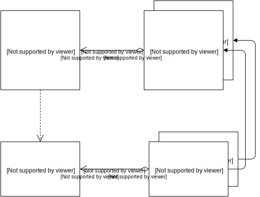
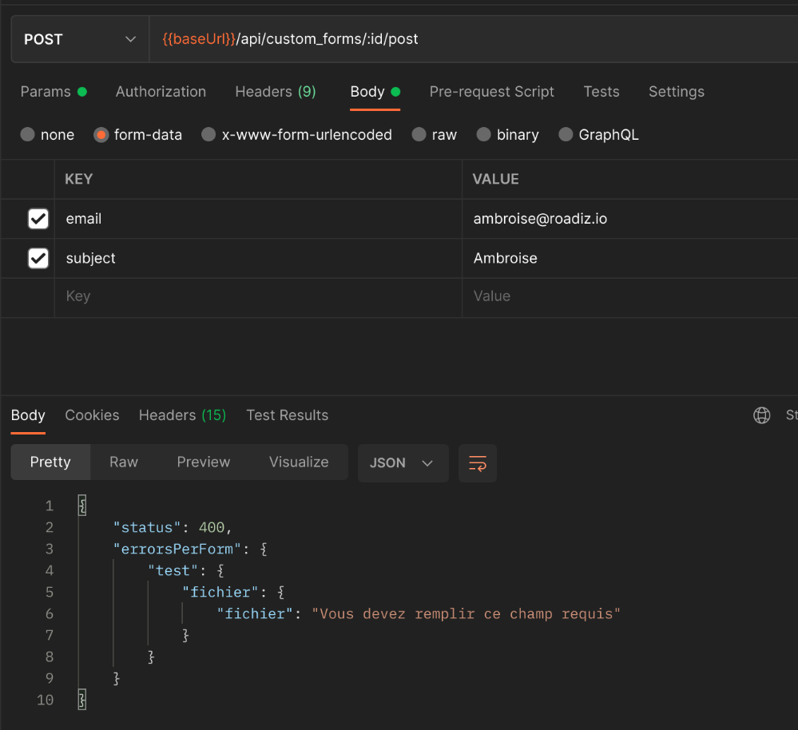
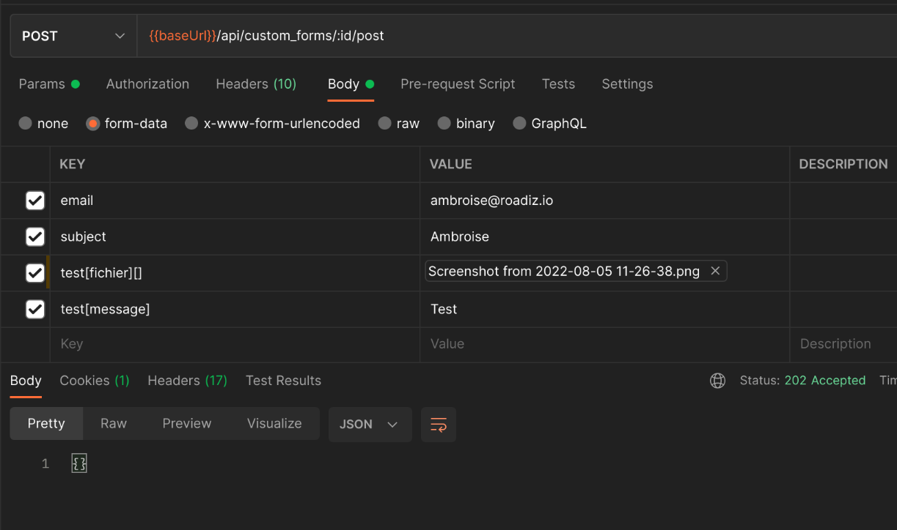
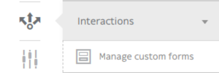
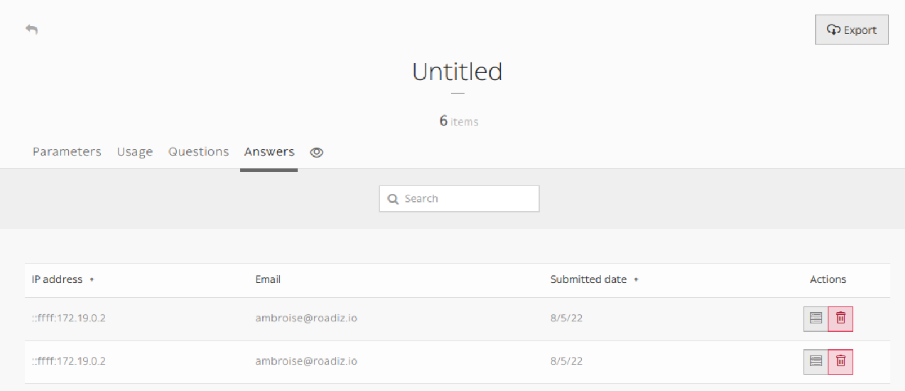
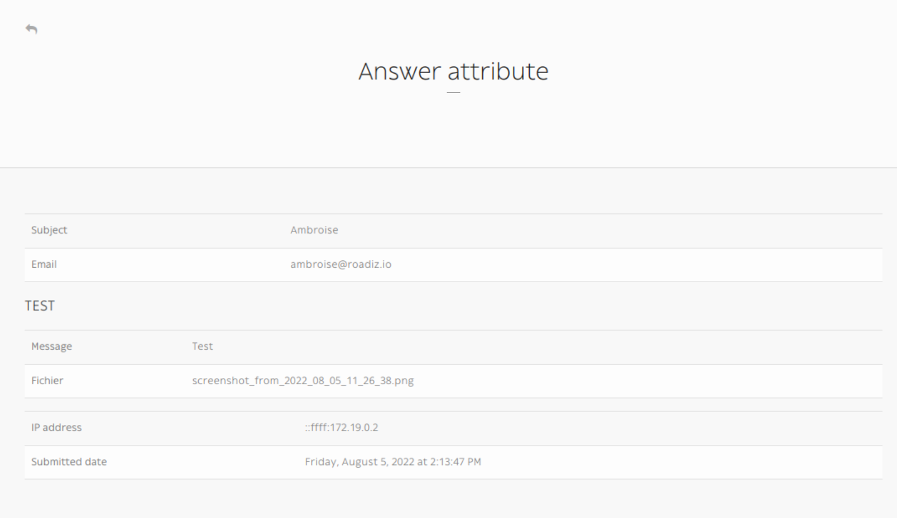

Building a custom form looks like building a node but it is a lot simpler! Let's have a look at structure image.

{.align-center}

After creating a custom form, you add some question. The questions are the CustomFormField type.

The answer is saved in two entities:
- in CustomFormAnswer
- in CustomFormFieldAttribute

The CustomFormAnswer will store the IP and the submitted time.
While question answer will be in CustomFormFieldAttribute with the CustomFormAnswer id and the CustomFormField id.

## Exposing a custom form in your API

Custom-form can be filled in a headless context, using \_definition and \_post endpoints:

```http
GET {{baseUrl}}/api/custom_forms/:id/definition
```

Custom form definition is a **JSON form schema** meant to give your frontend application a recipe to build a HTML form:

```json
{
    "title": "",
    "type": "object",
    "properties": {
        "subject": {
            "type": "string",
            "title": "Subject",
            "attr": {
                "data-group": null,
                "placeholder": null
            },
            "description": "Est aut quas eum error architecto.",
            "propertyOrder": 1
        },
        "email": {
            "type": "string",
            "title": "Email",
            "attr": {
                "data-group": null,
                "placeholder": null
            },
            "description": "Email address",
            "widget": "email",
            "propertyOrder": 2
        },
        "test": {
            "title": "TEST",
            "type": "object",
            "properties": {
                "message": {
                    "type": "string",
                    "title": "Message",
                    "attr": {
                        "data-group": "TEST",
                        "placeholder": null
                    },
                    "widget": "textarea",
                    "propertyOrder": 1
                },
                "fichier": {
                    "type": "string",
                    "title": "File",
                    "attr": {
                        "data-group": "TEST",
                        "placeholder": null
                    },
                    "widget": "file",
                    "propertyOrder": 2
                }
            },
            "required": [
                "fichier"
            ],
            "attr": {
                "data-group-wrapper": "test"
            },
            "propertyOrder": 3
        }
    },
    "required": [
        "subject",
        "email",
        "test"
    ]
}
```

Then you can send your data to the **post** endpoint using *FormData* and respecting field hierarchy:

{.align-center}

```http
POST {{baseUrl}}/api/custom_forms/:id/post
```

If there are any error, a *JSON* response will give you details fields-by-fields.

If post is successful, API will respond an empty `202 Accepted` response

{.align-center}

Then you will be able to see all your form submits in Roadiz backoffice :

{.align-left}

In Manage custom forms section / Answers

{.align-center}

::: tip
Any file attached to your custom-form answers will be uploaded as private documents.
:::

{.align-center}
