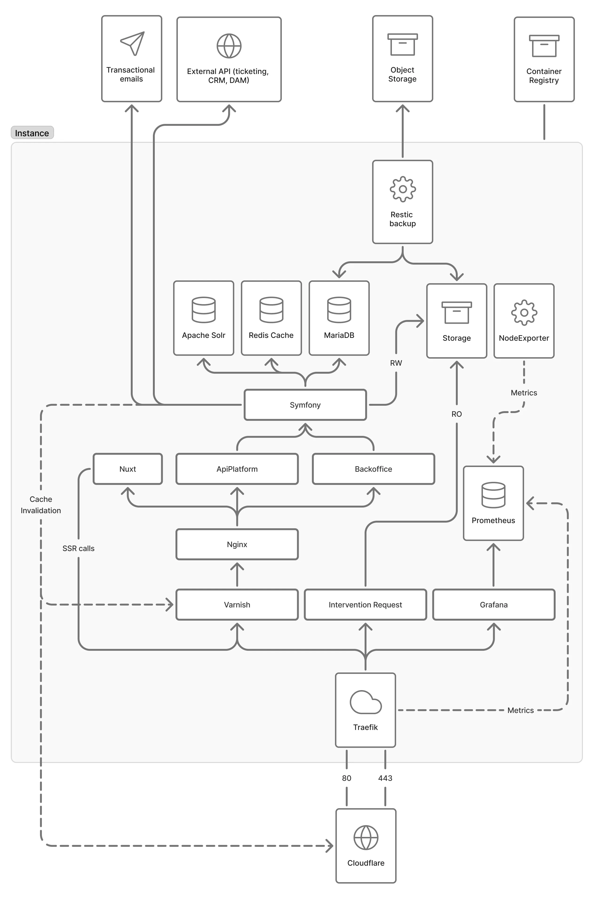

# Hosting infrastructure example

This is an example on how you can provide a complete technical architecture for your Roadiz website, highlighting the key components, data flows, and interactions between various services.

## Overview of the Infrastructure

The architecture is designed with modularity, high availability, scalability, and performance in mind.
It consists of multiple layers, including caching, backend, storage, and monitoring.
And this relies on containerized applications which applies for Docker, Docker Compose or even Kubernetes.

Key Technologies Used:
- (optional) Traefik for reverse proxy and traffic routing.
- (optional) Cloudflare for DDoS protection, traffic optimization, and caching.
- (optional) Varnish for HTTP request caching to improve performance.
- Nginx as the web server and proxy.
- Symfony as the backend framework.
- Nuxt.js for frontend with SSR (Server-Side Rendering). We use Nuxt for example but you can use another front-end.
- MariaDB/MySql as the relational database.
- (optional) Redis for session and object caching.
- (optional) Apache Solr for indexing and advanced search.
- (optional) Prometheus & Grafana for performance monitoring and visualization.

## **Request Flow and Logical Architecture**

### **Handling Incoming Requests**
1. User requests arrive via **Cloudflare**, which acts as a CDN and web application firewall (WAF).
2. **Traefik** accepts traffic on ports **80** and **443** and route it to internal services.
3. **Varnish** caches frequently accessed pages to enhance performance and reduce server load.
4. **Nginx** serves as a gateway between backend services and the frontend.

### **Backend and Data Processing**
1. **Symfony** serves as the core backend engine and interacts with:
    - **MariaDB** for structured data storage.
    - **Redis** for fast session and object caching.
    - **Apache Solr** for indexing and search functionality.

2. **ApiPlatform** exposes REST APIs used by the frontend and external services.

3. **Roadiz Backoffice** provides an administrative interface for content and user management.

## **Caching Flow and Invalidation**

### **Caching Layers**
The infrastructure relies on multiple caching layers to improve performance:
- **Varnish** caches full HTTP and API responses to accelerate content delivery.
- **Redis** stores session and specific database data. It can be useful to store temporary business cache and external API data.
- **Cloudflare** caches static assets and pages at the edge network.

### **Cache Invalidation Mechanisms**
Cache invalidation ensures that users receive up-to-date content without unnecessary database queries. The process includes:

1. **Varnish Cache Invalidation**
    - When content is updated in the database, Symfony triggers a **PURGE request** to Varnish.
    - Varnish clears the relevant cached objects and fetches fresh content from the backend.

2. **Redis Cache Invalidation**
    - Expiry times (TTL) are set for session data and dynamic queries.
    - When data is modified, Symfony automatically removes the corresponding Redis keys.

3. **Cloudflare Cache Purging**
    - Cloudflare cache can be manually or automatically purged via API when significant updates occur.
    - URL-based purging ensures that only modified content is refreshed.

## **Storage and Backup Management**
1. **Restic Backup** manages automated backups of databases and files to distant **S3 Object Storage**.
2. Critical data (logs, media files) is stored persistently in a secure **Storage** system.

## **Monitoring and Observability**
1. **NodeExporter** collects server metrics and sends them to **Prometheus**.
2. **Prometheus** stores and processes performance metrics, enabling anomaly detection.
3. **Grafana** provides real-time visualization dashboards for system monitoring.

## **External Integrations**
1. **Transactional Emails** for notifications and user interactions.
2. **External APIs** for ticketing, CRM, and DAM (Digital Asset Management).
3. **Container Registry** for managing and deploying containerized services.

## **Security and Scalability**
- **Cloudflare** protects against DDoS attacks and optimizes caching.
- **Traefik** and **Nginx** efficiently distribute incoming traffic.
- **Redis & Varnish** enhance response speed by reducing direct database queries.
- **Restic Backup** ensures data recovery in case of failure.
