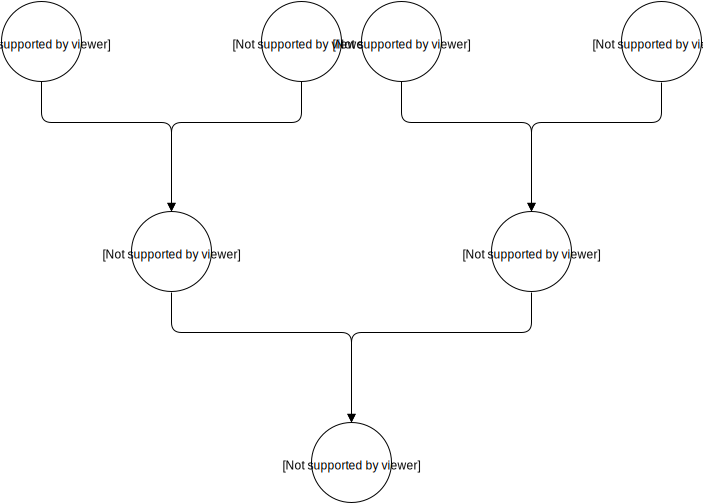
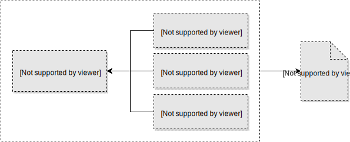
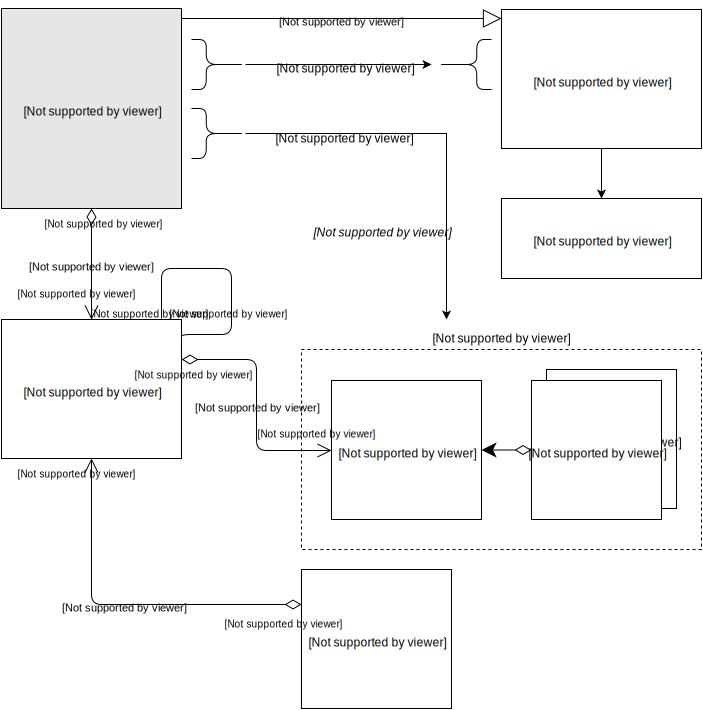

# Node-types, Node-sources, and Nodes

This is the most important part of Roadiz. Almost everything in your website will be a node.

Before explaining further, let's check this simple node schema:



Now, let's dive into how it works!

## What is a Node-type?

A **Node-type** is the blueprint for your node-source.  
It defines all the fields that Roadiz will use to generate an extended node-source class.



For example, a **node-type "Page"** might contain `"content"` and `"header image"` fields.  
The `"title"` field is always available as it is hardcoded in the `NodesSources` class.

After saving your node-type, Roadiz generates an `NSPage` class that extends the `NodesSources` class.  
You will find this in the `src/GeneratedEntity/` folder.  
Then, Roadiz calls Doctrine's update tool to migrate your database schema.

::: warning
**Do not modify the generated class manually.**  
Always update it through the backend interface.
:::

Here’s a schema that explains how node-types define custom fields in node-sources:



## Managing Node-types

All node-types management happens in the `app/config/node_types/*.yaml` files.  
You can create or update node-types and fields independently.

Some CLI commands are available to manage node-types:

```bash
bin/console nodetypes:default-values  # Get all default values for a field across all node-types
bin/console nodetypes:export-files    # Migrate database node-types to YAML files
bin/console nodetypes:list            # List available node-types or fields
bin/console nodetypes:validate-files  # Validate all node-type YAML files
```

## Database Migrations

Each time you **create a new node-type** or **add/remove fields**, a **database migration is required**.  
Doctrine needs to create new columns for your node-type fields.

After making changes, run:

```bash
bin/console app:migrate
```

::: tip
Doctrine must recognize your node-types before upgrading the database.  
If they don't exist, it might fail to create tables or even delete existing data.
To regenerate your node-types PHP classes, run:

```bash
bin/console generate:nsentities
```
:::

## Node-sources and Translations

Once a **node-type** is created, its definition is stored in the database inside  
the `node_types` and `node_type_fields` tables.  
This data is mainly used to build **node-source edition forms** in the back office  
and to generate a custom database table.

### Inheritance Mapping

In Roadiz, **each node-source is stored in a separate table** prefixed with `ns_`.

For example, creating a **"Page"** node-type with two fields (*content* and *excerpt*)  
will instruct Doctrine to build a `ns_page` table containing:

- Two columns (`content` and `excerpt`).
- One primary key column inherited from the `nodes_sources` table.

This is called **inheritance mapping**:

- `ns_page` extends `nodes_sources`.
- When querying a **Page** from the database, Doctrine **merges the data** from these two tables.

At the end, your **Page node-source** will contain many fields, not just its custom ones.  
The `NodesSources` entity automatically provides:

- `title`
- `metaTitle`
- `metaDescription`
- `metaKeywords`
- Other useful fields available across all node-types.

### Translations

Inheritance mapping also allows **data translations**.  
Each node can have multiple node-sources, one for each translation.

As shown in the schema, a node can store different language versions  
of its content within its node-sources.
