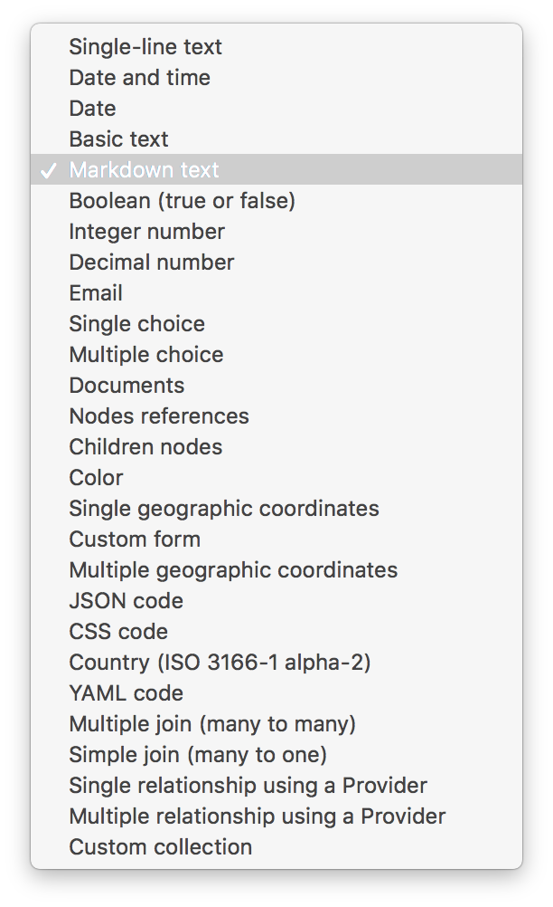

# Node-type fields

Roadiz can handle many types of node-type fields. Here is a complete list:

::: tip
- **Title**, **meta-title**, **meta-description**, and **keywords** are always available since they are stored directly inside the `NodesSources` entity. This ensures that you will always have a **title** no matter the node-type you are using.
  :::

## Simple data

The following fields store simple data in your custom node-source database table.

|                                            |                                   |
|--------------------------------------------|-----------------------------------|
| **Single-line text**                       | `string`                          |
| **Date**                                   | `date`                            |
| **Date and time**                          | `date-time`                       |
| **Basic long text**                        | `text`                            |
| **Markdown text**                          | `markdown`                        |
| **Boolean**                                | `boolean`                         |
| **Integer number**                         | `integer`                         |
| **Decimal number**                         | `decimal`                         |
| **Email**                                  | `email`                           |
| **Colour**                                 | `colour`                          |
| **Single geographic coordinates**          | `geographic.coordinates`          |
| **Multiple geographic coordinates**        | `multiple.geographic.coordinates` |
| **JSON code**                              | `json`                            |
| **CSS code**                               | `css`                             |
| **Country code (ISO 3166-1 alpha-2)**      | `country`                         |
| **YAML code**                              | `yaml`                            |
| **Many to many join**                      | `many-to-many`                    |
| **Many to one join**                       | `many-to-one`                     |
| **Single relationship using a provider**   | `single-provider`                 |
| **Multiple relationship using a provider** | `multiple-provider`               |
| **Custom collection**                      | `collection`                      |

{width=300}

## Single and multiple geographic coordinates

Geographic coordinates are stored in JSON format in your database using the [GeoJSON](https://geojson.org/) schema:

- A **single point** will be stored as a GeoJSON *feature* to hold additional properties such as *zoom*.
- **Multiple points** will be stored as a GeoJSON *feature collection*.

By default, Roadiz back-office uses the *Leaflet* library with *Open Street Map* for tiles rendering and basic geo-coding features.

## Markdown options

You can restrict Markdown fields buttons using the following YAML configuration:

```yaml
allow_h2: false
allow_h3: false
allow_h4: false
allow_h5: false
allow_h6: false
allow_bold: false
allow_italic: false
allow_blockquote: false
allow_list: false
allow_nbsp: false
allow_nb_hyphen: false
allow_image: false
allow_return: false
allow_link: false
allow_hr: false
allow_preview: false
```

## Virtual data

Virtual types do not store data in the node-source table. They display custom widgets in your editing page to link documents, nodes, or custom-forms with your node-source.

- **Documents**: `documents`
- **Nodes references**: `nodes`
- **Custom form**: `custom-forms`

## Complex data

These field types must be created with **default values** (comma-separated) to display available default choices for "select-box" types:

- **Single choice**: `single-choice`
- **Multiple choices**: `multiple-choice`
- **Children nodes**: `children-nodes`

The **Children node** field type is a special virtual field that displays a custom node-tree inside your editing page. You can add **quick-create** buttons by listing your node-types names in the **default values** input, comma-separated.

## Universal fields

If you need a field to hold exactly the same data for all translations, you can set it as **universal**. For example, for documents, numeric, and boolean data that do not change from one language to another.

It will duplicate data at each save time from the default translation to others. It will also hide the edit field from non-default translations to avoid confusion.

## YAML field

When you use the YAML field type, you get an additional method to return your code already parsed. If your field is named `data`, your methods will be generated in your *NSEntity* as `getData()` and `getDataAsObject()`.

- `getData()` method will return your YAML code as a *string*.
- `getDataAsObject()` will return mixed data, array, or `stdObject` according to your code formatting. This method will throw a `\Symfony\Component\Yaml\Exception\ParseException` if your YAML code is not valid.

## Many to many and Many to one joins

You can create custom relations between your node-source and whatever Doctrine entities in *Roadiz* or in your theme.

You must fill the **default values** field for these two types.

```yaml
# Entity class name
classname: Themes\MyTheme\Entities\City
# Displayable is the method used to display entity name
displayable: getName
# Same as Displayable but for a secondary information
alt_displayable: getZipCode
# Searchable entity fields
searchable:
    - name
    - slug
orderBy:
    - field: slug
      direction: ASC
```

You can use a custom proxy entity to support persisting `position` on your relation.

Roadiz will generate a one-to-many relationship with the proxy entity instead of a many-to-many.

In this scenario, you are responsible for creating and migrating `Themes\MyTheme\Entities\PositionedCity` entity.

If you are migrating from a non-proxied many-to-many relation, you should keep the same table and field names to keep data intact.

```yaml
# Entity class name
classname: Themes\MyTheme\Entities\City
# Displayable is the method used to display entity name
displayable: getName
# Same as Displayable but for a secondary information
alt_displayable: getZipCode
# Searchable entity fields
searchable:
    - name
    - slug
# This order will only be used for explorer
orderBy:
    - field: slug
      direction: ASC
# Use a proxy entity
proxy:
    classname: Themes\MyTheme\Entities\PositionedCity
    self: nodeSource
    relation: city
    # This order will preserve position
    orderBy:
        - field: position
          direction: ASC
```

## Single and multiple provider

The generic provider type allows you to fetch every data you want through a `Provider` class in your theme. This can be really useful if you need to fetch items from an external API and reference them in your nodes-sources.

Imagine that you want to link your page with an *Instagram* post. You’ll have to create a class that extends `Themes\Rozier\Explorer\AbstractExplorerProvider` and configure it in your field:

```yaml
classname: Themes\MyTheme\Provider\ExternalApiProvider
```

This provider will implement `getItems`, `getItemsById`, and other methods from `ExplorerProviderInterface` to display your *Instagram* posts in the Roadiz explorer widget and find your selected items back. Each *Instagram* post will be wrapped in a `Themes\Rozier\Explorer\AbstractExplorerItem` that maps your custom data to the right fields to be shown in the Roadiz back-office.

You’ll find an implementation example in Roadiz with `Themes\Rozier\Explorer\SettingsProvider` and `Themes\Rozier\Explorer\SettingExplorerItem`. These classes do not fetch data from an API but from your database using `EntityListManager`.

Single and multiple provider types can accept additional options too. If you want to make your provider configurable at runtime, you can pass `options` in your field configuration.

```yaml
classname: Themes\MyTheme\Provider\ExternalApiProvider
options:
    - name: user
      value: me
    - name: access_token
      value: xxxxx
```

Then you must override your provider’s `configureOptions` method to add which options are allowed.

```php
use Symfony\Component\OptionsResolver\OptionsResolver;

/**
 * @param OptionsResolver $resolver
 */
public function configureOptions(OptionsResolver $resolver)
{
    $resolver->setDefaults([
        'page' => 1,
        'search' => null,
        'itemPerPage' => 30,
        // add more default options here
        'user' => 'me',
    ]);
    // You can require options
    $resolver->setRequired('access_token');
}
```

## Custom collection

Last but not least, you can create a custom collection field to store read-only data using a dedicated *Symfony* `AbstractType`.

You must fill the **default values** field for this type:

```yaml
# AbstractType class name
entry_type: Themes\MyTheme\Form\FooBarType
```

You must understand that *custom collection* data will be stored as a JSON array in your database. So you won’t be able to query your node-source using this data.

In your `FooBarType`, you’ll be able to use *Symfony* standard field types and **Roadiz** non-virtual fields too, such as `MarkdownType`, `JsonType`, and `YamlType`.
