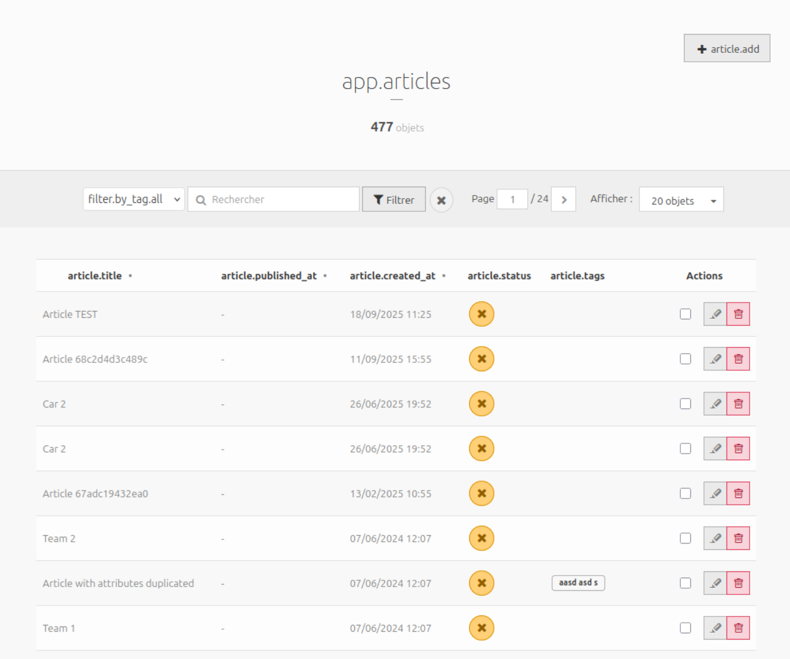

# Implement a backoffice entry to list all content for a specific NodeType and a shadow container node

::: info
**Since version 2.7**: `AbstractSingleNodeTypeController` is available to simplify the creation of custom backoffice entries for specific NodeTypes.
:::

This guide explains how to create a custom backoffice entry in Roadiz to list all nodes-sources for a specific NodeType, using the `NSArticle` example as a reference. Ensure your `NSArticle` node-type entity exists in `src/GeneratedEntity/NSArticle.php` and is mapped to your `Article` NodeType.

## Define a shadow container node

The `shadowContainer` is a concept used to organize and group nodes of a specific NodeType under a parent node in the content tree. This container is a real node in the database and acts as a logical root for listing, filtering, and managing related nodes in the backoffice, but this node is hidden from node-tree and cannot be accessed from API. By overriding the `getShadowRootNodeName()` method in your controller, you define the name of this container, allowing Roadiz to display all nodes of your NodeType (e.g., articles) as if they belong to a dedicated section, and create new nodes inside it, improving navigation and clarity in the admin interface.

## Create a DTO for your NodeType

DTOs (Data Transfer Objects) are useful for handling form data and validation. Create a DTO class for `NSArticle` (e.g., `src/Model/CreateArticleInput.php`):

```php
<?php

declare(strict_types=1);

namespace App\Model;

use ApiPlatform\Metadata\ApiProperty;
use RZ\Roadiz\CoreBundle\Entity\Tag;
use Symfony\Component\Serializer\Attribute\Groups;
use Symfony\Component\Validator\Constraints\Length;
use Symfony\Component\Validator\Constraints\NotBlank;

final class CreateArticleInput
{
    /**
     * @param array<Tag>|null $tags
     */
    public function __construct(
        #[NotBlank]
        #[Length(max: 200)]
        #[Groups(['article'])]
        private ?string $title = null,
        #[Groups(['article'])]
        #[ApiProperty(example: [
            '/api/tags/1',
            '/api/tags/2',
            '/api/tags/3',
        ])]
        private ?array $tags = null,
    ) {
    }

    public function getTitle(): ?string
    {
        return $this->title;
    }

    public function getTags(): ?array
    {
        return $this->tags;
    }

    public function setTitle(string $title): CreateArticleInput
    {
        $this->title = $title;

        return $this;
    }

    public function setTags(?array $tags): CreateArticleInput
    {
        $this->tags = $tags;

        return $this;
    }
}
```

## Create a FormType for your DTO

Create a Symfony form type for your NodeType entity (e.g., `src/Form/CreateArticleType.php`):

```php
<?php

declare(strict_types=1);

namespace App\Form;

use App\Model\CreateArticleInput;
use RZ\Roadiz\CoreBundle\Form\DataTransformer\TagArrayTransformer;
use RZ\Roadiz\CoreBundle\Form\TagsType;
use Symfony\Component\Form\AbstractType;
use Symfony\Component\Form\Extension\Core\Type\TextType;
use Symfony\Component\Form\FormBuilderInterface;
use Symfony\Component\OptionsResolver\OptionsResolver;
use Symfony\Component\Validator\Constraints\NotBlank;
use Symfony\Component\Validator\Constraints\NotNull;

final class CreateArticleType extends AbstractType
{
    public function __construct(
        private readonly TagArrayTransformer $tagArrayTransformer,
    ) {
    }

    public function buildForm(FormBuilderInterface $builder, array $options)
    {
        $builder
            ->add('title', TextType::class, [
                'label' => 'title',
                'constraints' => [
                    new NotNull(),
                    new NotBlank(),
                ],
            ])
            ->add('tags', TagsType::class, [
                'label' => 'tags',
                'required' => false,
            ])
        ;

        $builder->get('tags')->addModelTransformer($this->tagArrayTransformer);
    }

    #[\Override]
    public function configureOptions(OptionsResolver $resolver): void
    {
        $resolver->setDefault('data_class', CreateArticleInput::class);
    }
}
```

## Create a custom admin Controller

Now you can create a custom controller by extending `AbstractSingleNodeTypeController`. This base controller provides the necessary methods to handle listing, adding, and populating nodes-sources for your NodeType. Place your controller in the `App\Controller\Admin` namespace to clarify that it is for backoffice use. For example, in `src/Controller/Admin/ArticleController.php`.

::: info
`AbstractSingleNodeTypeController` declares 2 generic types: `<TEntity, TInputDto>`, this will help your IDE to understand which entity and DTO you are using in your controller.
:::

```php
<?php

declare(strict_types=1);

namespace App\Controller\Admin;

use RZ\Roadiz\RozierBundle\Controller\AbstractSingleNodeTypeController;
use App\GeneratedEntity\NSArticle;
use App\Form\CreateArticleType;
use App\Model\CreateArticleInput;

/**
 * @extends AbstractSingleNodeTypeController<NSArticle, CreateArticleInput>
 */
final class ArticleController extends AbstractSingleNodeTypeController
{
    #[\Override]
    protected function getRequiredRole(): string
    {
        return 'ROLE_ACCESS_NODES';
    }
    
    #[\Override]
    protected function getNodeTypeName(): string
    {
        return 'Article';
    }

    #[\Override]
    protected function getEntityClass(): string
    {
        return NSArticle::class;
    }

    #[\Override]
    protected function getFormType(): string
    {
        return CreateArticleType::class;
    }

    #[\Override]
    protected function createInputDto(): object
    {
        return new CreateArticleInput();
    }

    #[\Override]
    protected function getDefaultRouteName(): string
    {
        return 'admin_article_list'; // Must match your route name for the list page
    }

    #[\Override]
    protected function getShadowRootNodeName(): string
    {
        return 'articles'; // Must match you existing shadow container node name
    }

    #[\Override]
    protected function populateItem(object $input, Request $request): NodesSources
    {
        $item = parent::populateItem($input, $request);

        // Implement any custom logic to populate your NodeSource entity from the input DTO
        $item->setTitle($input->getTitle());
        $item->setPublishedAt(null);
        $item->getNode()->setTags($input->getTags() ?? []);

        return $item;
    }
}
```

## Register the Controller Route

Add a route in your configuration (e.g., `config/routes.yaml`):

```yaml
admin_article_list:
    path: /rz-admin/articles
    defaults:
        _controller: App\Controller\Admin\ArticleController::defaultAction

admin_article_add:
    path: /rz-admin/articles
    defaults:
        _controller: App\Controller\Admin\ArticleController::addAction
```

## Create Twig Templates

Create Twig templates in `templates/admin/article/` to support your backoffice entry:

- `list.html.twig`: Lists all nodes-sources for your NodeType.
- `add.html.twig`: Displays a form to add a new node-source.
- `row.html.twig`: Displays a single item row (only its `<td>`).
- `row_header.html.twig`: Displays listing table header (only its `<th>`).

Example structure:
```
templates/
└── admin/
    └── article/
        ├── add.html.twig
        ├── bulk_base.html.twig
        ├── bulk_delete.html.twig
        ├── bulk_publish.html.twig
        ├── bulk_unpublish.html.twig
        ├── list.html.twig
        ├── row.html.twig
        └── row_header.html.twig
```

You can start by copying and customizing templates from the Rozier bundle, adapting them to your fields and UI needs. Use Twig to loop through your node-sources and render forms using Symfony's form helpers.

::: info
There is no `edit.html.twig` template required, as `AbstractSingleNodeTypeController` redirects users to the classic Roadiz edit nodes-sources page for editing actions.
:::

## Add a Backoffice Entry in `roadiz_rozier.yaml`

To make your custom backoffice entry visible in the Roadiz admin menu, add an entry to the `entries` section of your `config/packages/roadiz_rozier.yaml` file. For example, to add an entry for your articles list:

```yaml
roadiz_rozier:
    # ...existing config...
    entries:
        # ...existing entries...
        articles:
            name: articles
            route: admin_article_list  # This should match your route name in routes.yaml
            icon: uk-icon-paper-plane  # Choose an icon from UIkit or Roadiz icon set
            roles: [ 'ROLE_BACKEND_USER' ] # Optional: restrict access to specific roles
```

- `name`: The label shown in the menu.
- `route`: The Symfony route name for your controller action (e.g., `admin_article_list`).
- `icon`: The icon for your entry (UIkit or Roadiz icon class).
- `roles`: (Optional) Array of roles required to see this entry.

::: tip
You can add subentries for more granular navigation, following the structure used for `nodes` in the example above.
:::

This completes the process for adding a custom backoffice entry, including making it visible in the Roadiz admin menu via `roadiz_rozier.yaml`.

---

::: tip
You can repeat this process for any NodeType by creating a corresponding entity, form type, DTO, and controller in the `Admin` namespace, then registering the route and templates.
:::

## Test Your Backoffice Entry

Visit `/rz-admin/articles` in your backoffice to see the list of all `NSArticle` nodes-sources and manage them using your custom forms and templates. Editing actions will redirect to the classic Roadiz edit nodes-sources page.



## Enable bulk actions (optional)

Add the following methods to your controller to enable bulk actions like publish, unpublish, and delete:

```php
    protected function getBulkPublishRouteName(): ?string
    {
        return 'admin_article_bulk_publish';
    }

    protected function getBulkUnpublishRouteName(): ?string
    {
        return 'admin_article_bulk_unpublish';
    }

    protected function getBulkDeleteRouteName(): ?string
    {
        return 'admin_article_bulk_delete';
    }
```

Add corresponding routes in `routes.yaml`:

```yaml
admin_article_bulk_delete:
    methods: [GET, POST]
    path:     /rz-admin/articles/bulk-delete
    defaults:
        _controller: App\Controller\Admin\ArticleController::bulkDeleteAction
admin_article_bulk_publish:
    methods: [GET, POST]
    path:     /rz-admin/articles/bulk-publish
    defaults:
        _controller: App\Controller\Admin\ArticleController::bulkPublishAction
admin_article_bulk_unpublish:
    methods: [GET, POST]
    path:     /rz-admin/articles/bulk-unpublish
    defaults:
        _controller: App\Controller\Admin\ArticleController::bulkUnpublishAction
```

::: tip
`bulkDeleteAction`, `bulkPublishAction` and `bulkUnpublishAction` methods are already implemented in AbstractSingleNodeTypeController.
:::

And create Twig templates for bulk actions in `templates/admin/article/`. You can copy and adapt them from https://github.com/roadiz/core-bundle-dev-app/tree/develop/templates/admin/article.
