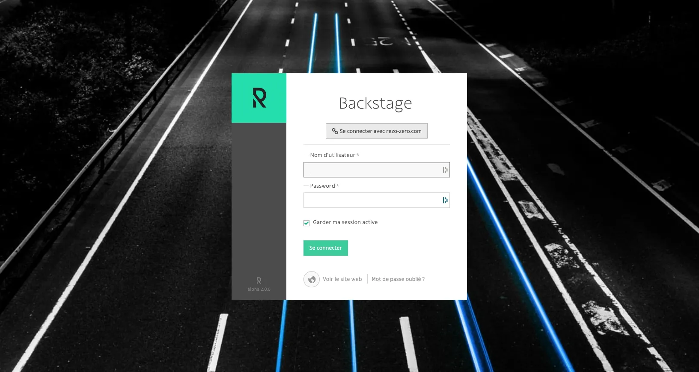

# Se connecter au back-office

Le lien de connexion vers votre back-office vous est communiqué par un administrateur.
Par défaut, vous accéderez à la page de connexion :

Votre identifiant vous est transmis par email ; si vous avez oublié votre identifiant, renseignez votre email dans le champ Nom d’utilisateur. 

Si vous avez oublié votre mot de passe, **”Mot de passe oublié ?”** **vous permettra de le charger après avoir suivi un lien temporaire envoyé à votre adresse email.

Si vous n’avez pas accès à votre email et/ou identifiants, contactez un administrateur de votre back-office. 

::: tip
💡 Les mots de passe sont stockés de manière “hashée” cryptographiquement, celà veut dire que personne ne pourra retrouver votre mot de passe, et ce, même s’il a un accès à la base de donnée technique de votre site. Si vous avez oublié, ou perdu, votre mot de passe, vous serez invité·e à en créer un nouveau.
:::
