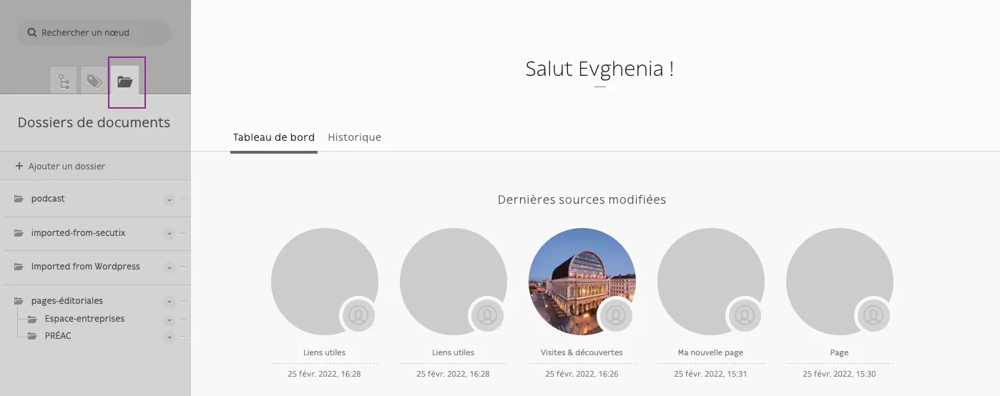

# Dossiers de documents

Votre CMS vous permet de créer des dossiers et des sous-dossiers pour gérer vos fichiers (documents, images, vidéos). 
Pour accéder aux dossiers, cliquez sur l’onglet correspondant:

### Tuto de création d’un dossier et des sous-dossiers.

<video alt="Tuto de création d’un dossier et des sous-dossiers." controls>
    <source src="/user/dossiers_de_documents/Enregistrement_de_lecran_2022-02-25_a_16.49.21.webm" type="video/webm">
    Your browser does not support the video tag.
</video>

### Tuto ranger les fichiers dans les dossiers (lier).

<video alt="Tuto ranger les fichiers dans les dossiers (lier)" controls>
    <source src="/user/dossiers_de_documents/Enregistrement_de_lecran_2022-02-25_a_16.50.55.webm" type="video/webm">
    Your browser does not support the video tag.
</video>

