# Édition des contenus

## Gérer les nœuds

Les nœuds sont les éléments les plus importants du CMS Roadiz. Ils permettent la mise en forme de votre contenu telle que vous le souhaitez, en fonction de la définition de vos types de nœuds. Un nœud peut être un post de blog, une page de contenu, une galerie photo, ou même un produit de l’e-boutique. Voilà pourquoi nous l’avons appelé « Nœud » : c’est une unité de données abstraite et interconnectée avec le reste de votre arborescence.

Des indicateurs graphiques vous informent sur le statut de publication d’un nœud. Un nœud peut être une page du site ou un bloc.

- **Losange : brouillon**
  
  Le losange indique que le nœud est en brouillon (visible par les administrateurs du CMS en prévisualisation uniquement).
- **Cercle : publié**
  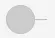
- **Losange barré : dépublié et caché**
  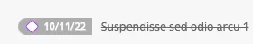
  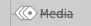
- **Cercle barré : publié et caché**
  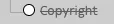
  Le cercle indique que le contenu est publié et visible sur le site. Ce statut indique que le contenu est dépublié (brouillon) et caché (il ne sera visible par personne).
  S'il s'agit d'un bloc, il ne sera pas visible (ni par les administrateurs, ni par des internautes).
  S'il s'agit d'une page, elle ne sera pas visible dans le site si elle est reliée à l’arborescence principale, mais sera quand même disponible en ligne si un internaute dispose de son URL.
- **Titre barré** : indique que le nœud est caché (n’est pas visible par les utilisateurs du site, ni par les utilisateurs du back-office connectés).

### Navigation dans l’arborescence

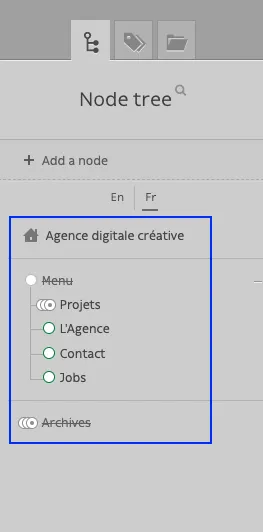

Chaque nœud a sa place dans votre site et c’est pourquoi nous avons choisi d’organiser votre contenu à travers une arborescence. C’est intuitif et cela fonctionne de la même manière que la gestion des fichiers de votre ordinateur.

- Pour éditer le contenu d’un nœud, cliquez simplement dessus.
- D’autres options sont disponibles à partir du menu contextuel de chaque nœud. Faites un clic droit sur le nœud ou cliquez sur la flèche droite qui apparaît au survol.

    <video controls>
    <source src="/user/edition_des_contenus/Enregistrement_de_lecran_2022-12-05_a_15.27.11.webm" type="video/webm">
    Your browser does not support the video tag.
    </video>

- Vous pouvez replier/déplier des morceaux de votre arborescence en cliquant sur le `+` ou le `-` à droite de chaque nœud. L’état sera gardé en mémoire pour vous permettre d’accéder plus rapidement à vos contenus favoris.

    <video controls>
    <source src="/user/edition_des_contenus/Enregistrement_de_lecran_2022-12-05_a_15.25.07.webm" type="video/webm">
    Your browser does not support the video tag.
    </video>

- Pour déplacer un nœud dans votre arborescence, réalisez un glisser-déposer grâce à la poignée (en forme de rond ou de losange). Vous pouvez déposer un nœud avant ou après un autre élément. Vous pouvez également le déposer à l’intérieur d’un autre nœud, en décalant légèrement votre souris vers la droite de ce dernier pour déplacer l’ombre du nœud à l’intérieur.

    <video controls>
    <source src="/user/edition_des_contenus/Enregistrement_de_lecran_2022-12-05_a_15.30.24.webm" type="video/webm">
    Your browser does not support the video tag.
    </video>

### Actions des menus contextuels

- *Ajouter un nœud enfant* : créer une zone de contenu à l’intérieur d’un nœud existant (page ou blocs)
- *Éditer* : renvoie à la page d’édition de contenu du nœud concerné.
- *Déplacer en première position* : déplacer un nœud à la première position au sein de l’arborescence du nœud parent.
- *Déplacer en dernière position* : déplacer en dernière position de l’arborescence du parent.
- *Supprimer* : placera le nœud actuel dans la corbeille. Une fenêtre de confirmation s’ouvrira afin de supprimer un nœud. Le nœud n’est pas supprimé définitivement, il se retrouve dans la corbeille.
- *Cacher/Afficher* : changer la visibilité d’un nœud. Un nœud caché ne sera pas indexé dans votre site.
- *Publier/Dépublier* : changer le statut de publication d'un nœud. Les nœuds non publiés ne sont pas visibles pour les visiteurs anonymes, mais visibles pour les utilisateurs du back-office en prévisualisation. Il s’agit de mettre en brouillon un nœud publié et inversement.
- *Publier la descendance* : publier un nœud et tous ses nœuds enfants rattachés.
- *Dupliquer* : Copier l’intégralité du contenu et des interactions du nœud actuel dans un nouveau nœud.

## Création d’un nœud

Le bouton **Ajouter un nœud** est situé en haut de votre *arborescence*.

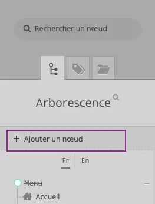

Le bouton **« Ajouter un nœud enfant »** est situé en haut de chaque menu contextuel d’un nœud.

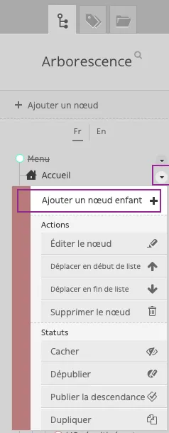

Pour ajouter un nœud vide à votre arborescence, vous devrez choisir son emplacement. À l’intérieur du CMS, vous pouvez ajouter un contenu à la racine de votre arbre ou choisir un « nœud parent ». Dans les deux cas, vous serez invité à choisir un *type* et un *nom* avant de créer votre nœud.

- Le **Titre** est l’identifiant global de votre nœud. Il doit être unique et ne changera pas d’une traduction à une autre. Il peut être modifié ultérieurement, sauf si votre développeur a verrouillé sa modification. Le **Titre** est utilisé pour construire les URL de vos pages, de manière générale.
- Le **Type de nœud** (Node type) définit les champs disponibles de votre contenu. Choisissez-le bien, car la modification ne sera pas possible ultérieurement ; il vous faudra supprimer le nœud et en créer un nouveau en cas d’erreur.

<video controls>
<source src="/user/edition_des_contenus/Enregistrement_de_lecran_2022-12-06_a_10.15.26.webm" type="video/webm">
Your browser does not support the video tag.
</video>

## Éditer un nœud existant

### Contenu

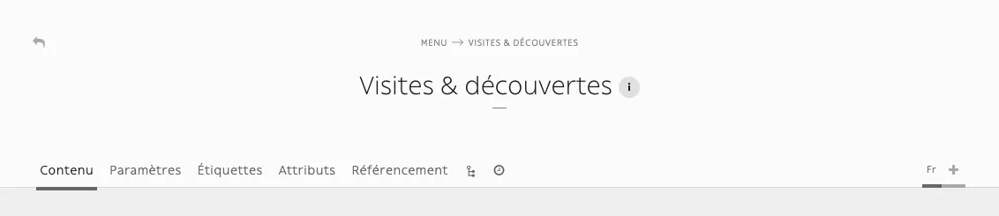

L’onglet Contenu vous permet de modifier les données spécifiques de votre nœud, en utilisant des types de champs tels que **contenu** ou **image**, etc.
L’onglet Contenu vous propose d’ajouter également les **Blocs** compatibles avec le gabarit en question. Cet onglet affichera les différents contenus traduits du nœud en fonction des champs marqués **Universel** ou non.

**Champ universel** : le petit drapeau vous indique que ce champ est universel ; il sera donc repris automatiquement dans toutes les langues du site (il suffit de le remplir une fois pour la version FR ; il sera repris pour la version EN).

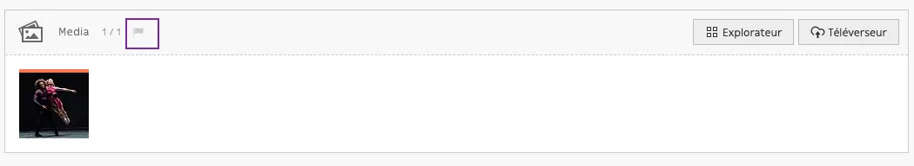

**Nombre d’items requis** : le petit indicateur de certains champs vous permet de connaître le nombre d’items requis, par exemple :

- `0/1` : le champ n’est pas rempli ; nombre max d’items est 1 *(vous ne pourrez pas mettre plus d’une image dans ce champ)*
- `1/1` : le champ est rempli ; nombre max d’items est 1

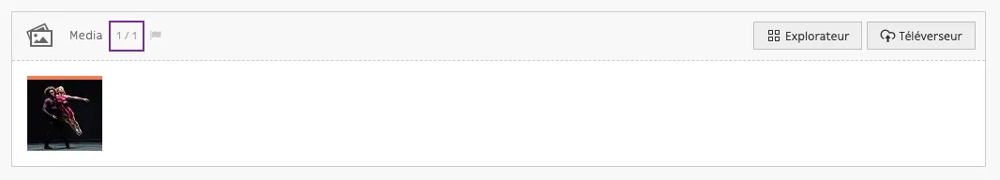

Si l’indicateur est rouge, il s’agit d’un champ obligatoire (erreur si le champ n’est pas rempli) :

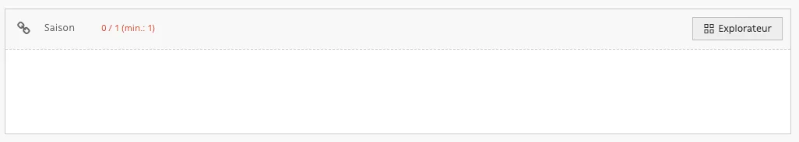

### Paramètres

Les paramètres sont des données globales telles que votre **nom de nœud**. Ils sont utilisés pour gérer la visibilité de votre nœud en fonction des rôles de chaque utilisateur et des paramètres de chaque nœud. **Cette section ne doit pas être utilisée de façon régulière** puisque les paramètres sont fixés par votre développeur en amont pour correspondre à vos besoins.

::: tip
Cet onglet affichera le même contenu quel que soit la traduction.
:::

L’information relative au **TTL frontal** vous indique le nombre de minutes prévu pour l’affichage de la mise à jour du front-office (par exemple, si le TTL frontal vous indique 10 minutes, une page sera mise à jour en front-office 10 minutes après sa publication). Il s’agit d’un temps de mise en cache. En revanche, la modification d'un contenu depuis le back-office invalide ce cache et permet de voir les changements instantanément.

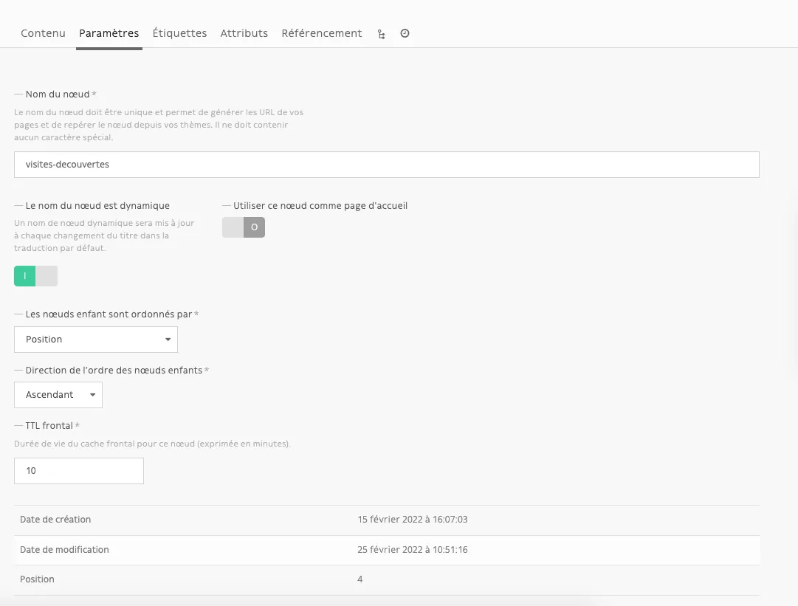

### Étiquettes

Si le gabarit concerné est prévu pour l’ajout des étiquettes, vous pourrez les sélectionner à l’aide de l’explorateur. Les étiquettes devront être créées en amont.

::: tip
Cet onglet affichera le même contenu quel que soit la traduction.
:::

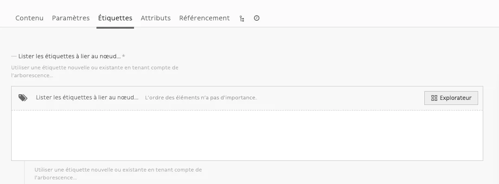

<video controls>
<source src="/user/edition_des_contenus/Enregistrement_de_lecran_2023-03-28_a_12.15.27.webm" type="video/webm">
Your browser does not support the video tag.
</video>

### Référencement

Cet onglet vous permet de définir le **Titre** et la **Méta-description** de la page.
Ces informations seront affichées notamment sur la page de résultat de recherche des moteurs de recherche. 

- Le **titre** de référencement permet de rédiger entièrement le titre de votre page. Pour un affichage optimal dans les moteurs de recherche, le titre ne doit pas dépasser 55 à 65 caractères en moyenne.
- La **description** est un résumé de quelques caractères de votre page. Son objectif est de décrire succinctement son contenu. Cette description doit respecter une taille entre 120 et 155 caractères.

::: warning
Cet onglet affichera les contenus en fonction de chaque traduction.
:::

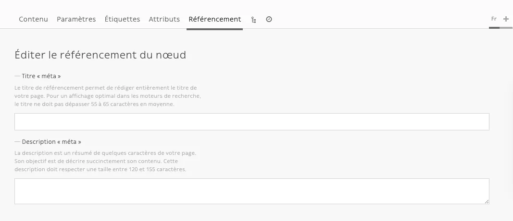

C’est également dans cet onglet que vous pouvez gérer les alias d’URL et les redirections.

### Alias d’URL

Les alias d’URL permettent de réécrire la dernière partie de l’URL de votre page pour chaque traduction. Ils doivent être différents du nom du nœud et uniques sur tout votre site.

### Redirections

Les redirections automatiques permettent de rediriger la requête saisie vers l'URL actuelle du nœud, et pour cette langue en particulier. Les redirections créées sont toujours du type "permanent".

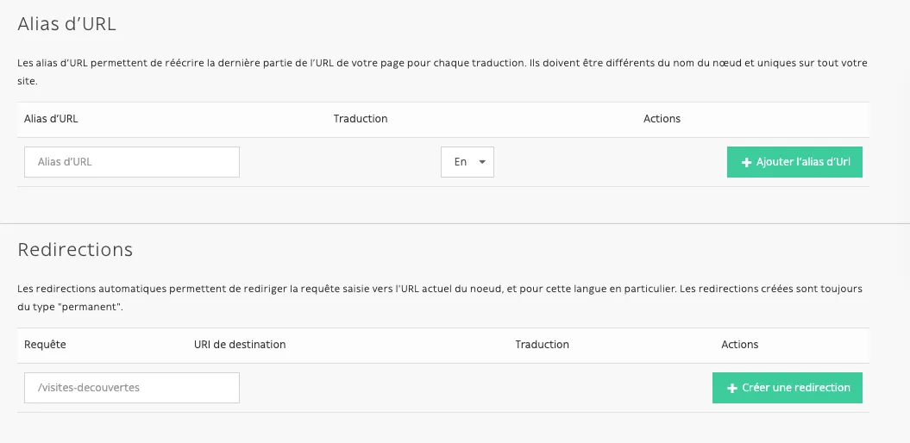

### Attributs

Cet onglet est destiné à l’usage des développeurs ; vous n’aurez pas d’administration de contenus à mener dans cet onglet.

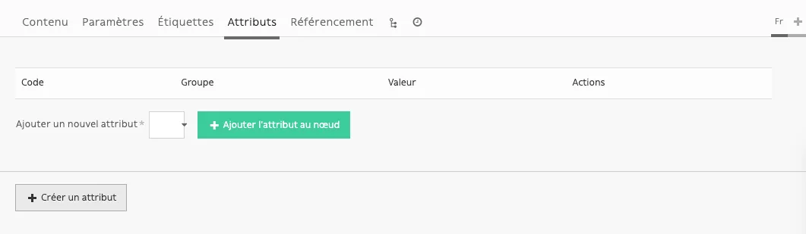

### L’arborescence

Quand un nœud est défini en tant que conteneur, son *arborescence* devient la vue (onglet) par défaut. Vous pouvez définir l’ordre par défaut d’affichage des nœuds enfants dans l’onglet *Paramètres*. De plus, si le *type de nœud* est *publiable*, chaque nœud affichera sa date de publication avant son *titre*.

Reconnaître un conteneur dans votre vue arborescente du site :

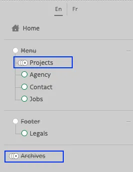

Liste des nœuds d’un conteneur :

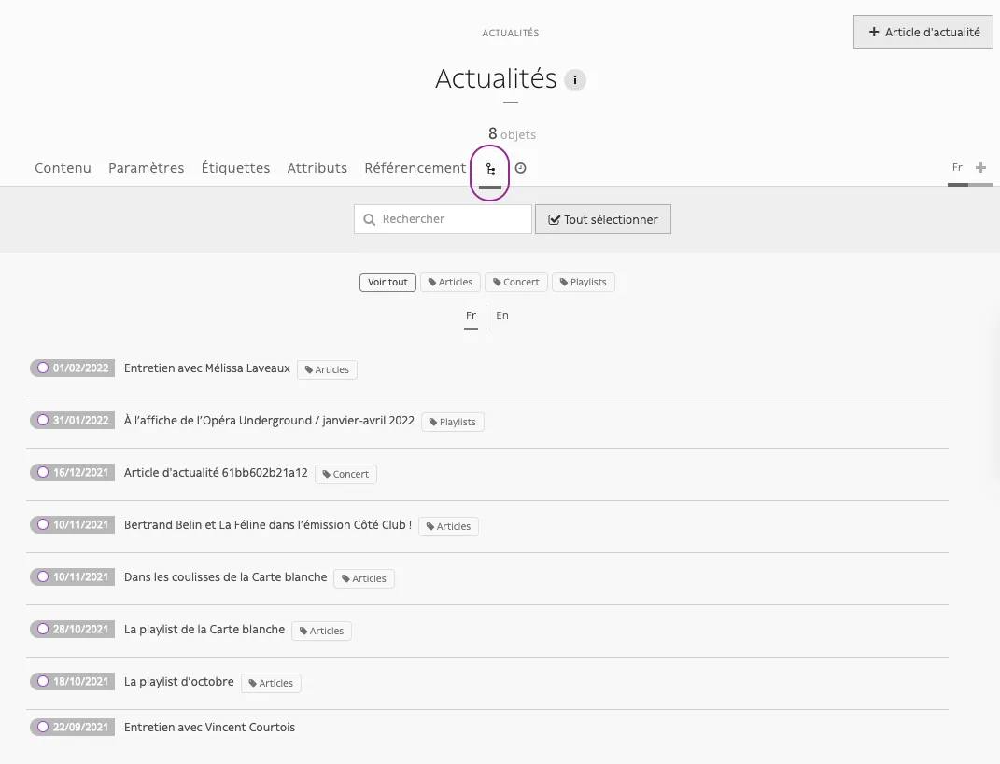

Pour ajouter un nouvel élément dans un conteneur, cliquez sur le bouton en haut à droite :

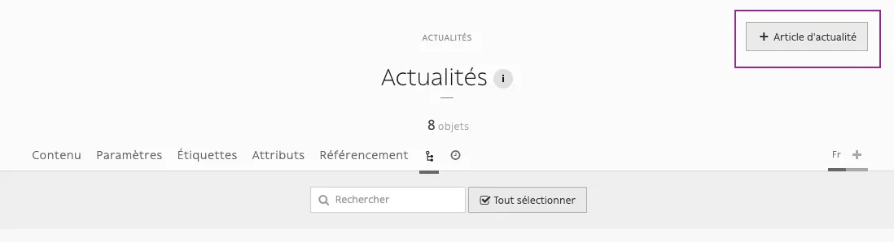

Si le nœud n’est pas un conteneur, la vue arborescente vous montre les blocs constituant le nœud. La vue de l’arborescence devient très intéressante si vous possédez un très grand nombre de nœuds enfants.

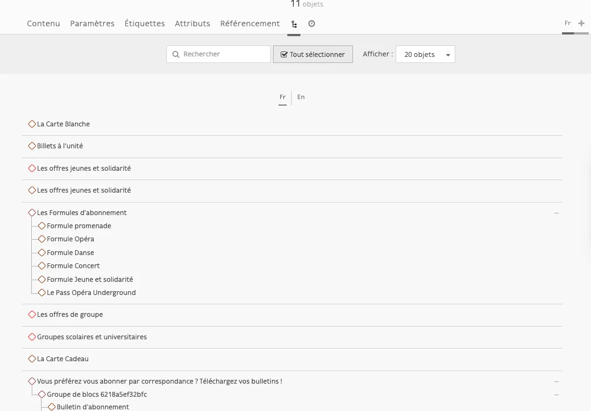

## Duplication d’un nœud et placement sur une autre page

Certains blocs peuvent être repris en intégralité et placés sur une autre page. Pour ce faire, il est nécessaire de dupliquer l’ensemble des blocs correspondants et de les glisser dans l’arborescence. Exemple :

<video controls>
<source src="/user/edition_des_contenus/Enregistrement_de_lecran_2023-03-28_a_12.19.44.webm" type="video/webm">
Your browser does not support the video tag.
</video>

## Menu d’action

À droite de votre écran, vous disposez d’un menu d’action qui vous permettra de gérer votre nœud :

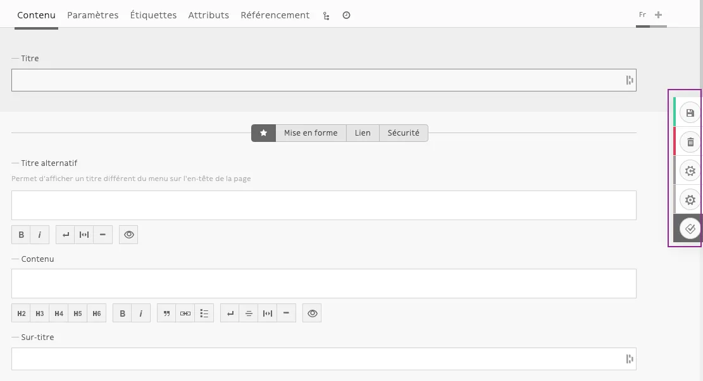

### Sauvegarder

Le bouton Sauvegarder est l’un des plus importants dans la gestion de vos contenus. Après chaque ajout ou modification de contenus, n’oubliez pas de cliquer sur le bouton Sauvegarder, sinon les actions de remplissage et modifications effectuées dans le back-office ne seront pas prises en compte.

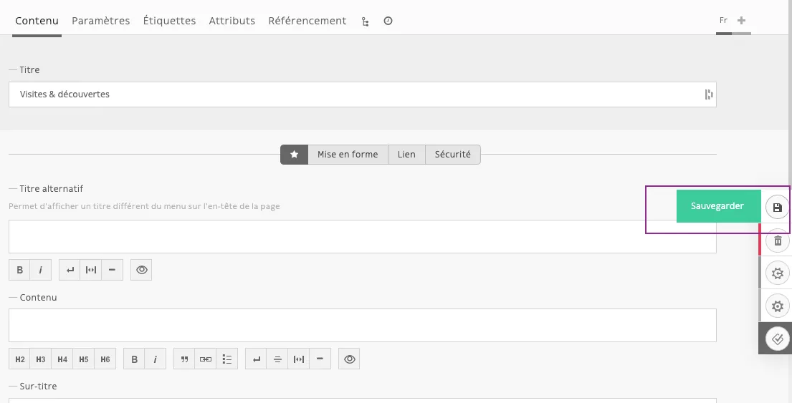

### Supprimer le nœud

Cette action place votre nœud dans la corbeille

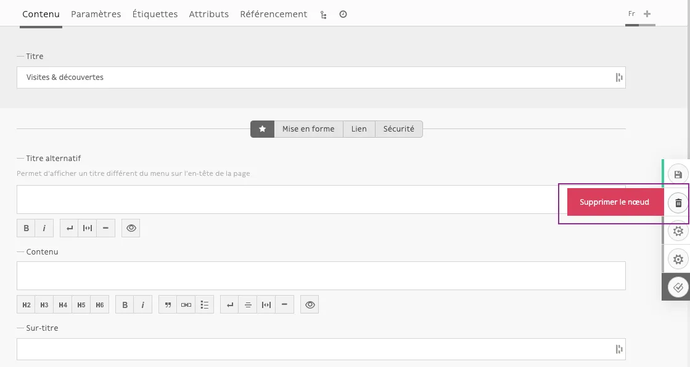

### Supprimer une traduction

⚠️ Lorsque vous travaillerez sur une seconde traduction d’un nœud, un deuxième bouton *Supprimer* apparaîtra pour supprimer la traduction uniquement.
**Attention, la suppression d’une traduction n’est pas récupérable !**

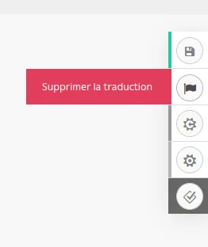

### Actions

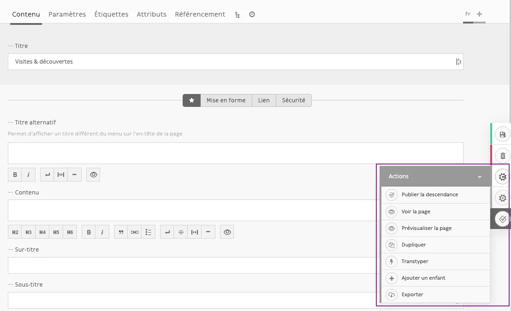

- **Publier la descendance** : publier un nœud et tous ses nœuds enfants rattachés.
- **Voir la page** : permet de voir les contenus publiés de la page correspondante (ouverture dans un nouvel onglet de l’URL de la page en front-office)
- **Prévisualiser la page** : permet de voir les contenus publiés et dépubliés (en brouillon) de la page correspondante
- **Dupliquer** : permet de copier l’intégralité du contenu et des interactions du nœud actuel dans un nouveau nœud
- **Transtyper** : permet de changer le type de nœud
    ::: warning
    💡 La fonctionnalité *Transtyper* est destructive et peut vous faire perdre tous les champs n’existant plus dans le type de nœud de destination.
    :::
- **Ajouter un enfant** : créer une zone de contenu à l’intérieur d’un nœud existant (page ou blocs)
- **Exporter** : utilisation rare ou inexistante

### Paramètres

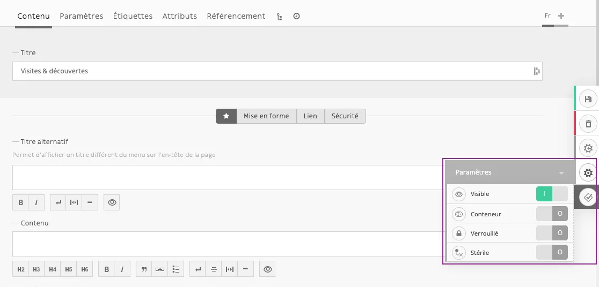

Ces paramètres s’appliquent au niveau du nœud et donc ils seront identiques pour chaque traduction.

- **Visibilité** : cache ou affiche le nœud actuel (en fonction du développement de votre thème).
- **Conteneur** : transforme le nœud actuel en **conteneur** ; les nœuds enfants n’apparaîtront plus dans le panneau global d’arborescence. À utiliser avec parcimonie (privilégiez la création d’un conteneur).
- **Verrouillage** : empêche les utilisateurs de supprimer le nœud actuel ou de le renommer. Vous devriez activer ce mode si le nœud actuel est requis dans la logique de votre thème.
- **Nœud stérile** : empêche les utilisateurs de créer des nœuds enfants.

## Statuts

Pendant son cycle de vie, chaque nœud peut avoir différents statuts de publication. Lorsque vous créez un nouveau contenu, il sera automatiquement publié comme **Brouillon** par le CMS afin de vous permettre de le modifier sans incidence sur vos visiteurs et sans rendre public un contenu en cours de réalisation.

- **Brouillon** : statut initial pour chaque nouveau nœud
- **En attente de validation** : un statut intermédiaire disponible pour les utilisateurs n’ayant pas les droits de publication
- **Publié** : il s’agit du statut le plus important, il rend votre contenu public aux visiteurs de votre site
- **Archivé** : lorsque vous ne souhaitez pas publier un nœud mais ne voulez pas non plus le supprimer de votre interface
- **Supprimé** : il s’agit du dernier statut disponible pour vos nœuds. Avant de vider votre corbeille, chaque nœud sera affiché avec cette mention.

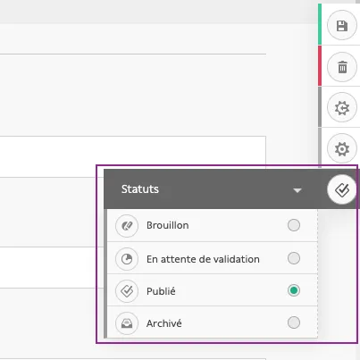

Pour améliorer la visibilité des statuts, les nœuds au stade de *brouillon* et *en attente de validation* sont présentés sous la forme d’un losange alors que les nœuds *publiés* ont une forme circulaire.

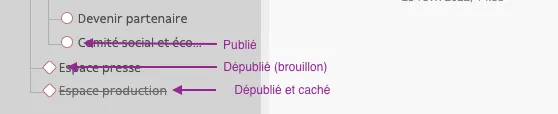
