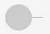
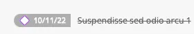
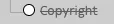
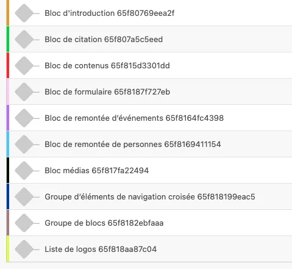
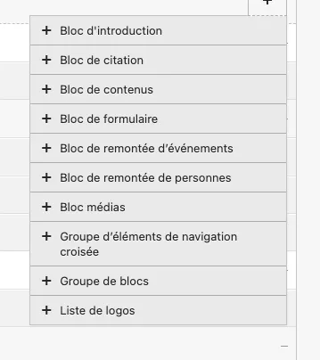

# États (publié, dépublié, caché)

Le CMS est construit à l’aide de différents nœuds. Des indicateurs graphiques vous informent sur le statut de publication d’un nœud. Un nœud peut être une page du site ou un bloc.

- **Cercle** 
    
    Le cercle indique que le contenu est publié et visible par les utilisateurs du site, publiquement

- **Losange** 
    
    Le losange indique que le nœud est **en brouillon** (visible par les administrateurs du CMS en “preview” uniquement). **URL désactivée**

- **Losange barré : dépublié et caché** 
    
    

- **Cercle barré : publié et caché**

    
    
    Ce statut indique que le contenu est dépublié (brouillon) et caché **(il ne sera visible par personne)**
    
    S'il s'agit d'une page, elle ne sera pas visible dans le site si elle est reliée à l’arborescence principale, mais sera **quand même disponible en ligne si un internaute dispose de son URL**

## Couleurs

Chaque nœud possède sa propre couleur (barre verticale de gauche) 

Pour connaitre le type de bloc sur une page, survolez le cercle ou le losange avec votre souris :

<video controls>
<source src="/user/etats/Enregistrement_de_lecran_2024-08-27_a_12.32.59.webm" type="video/webm">
Your browser does not support the video tag.
</video>
