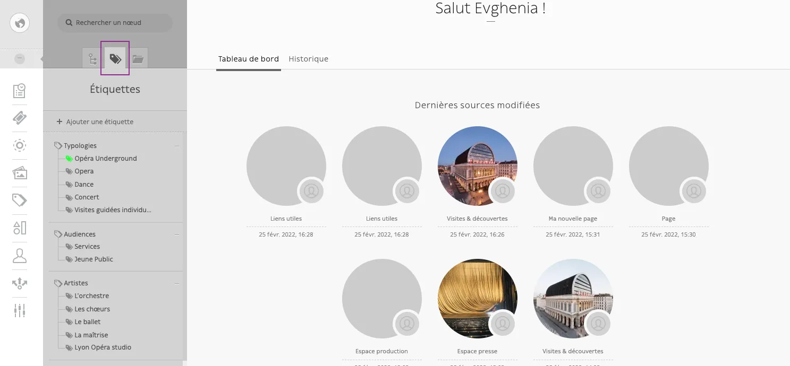
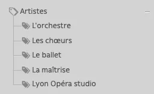

# Étiquettes

Certains nœuds (pages ou blocs) sont gérés via des tags (étiquettes).

L’accès aux étiquettes se fait par l’onglet correspondant :

On distingue des étiquettes parent et des étiquettes enfant

## Tuto création d’étiquette parent 

<video controls>
<source src="/user/etiquettes/Enregistrement_de_lecran_2022-02-25_a_16.39.06.webm" type="video/webm">
Your browser does not support the video tag.
</video>

## Tuto création étiquette enfant 

<video controls>
<source src="/user/etiquettes/Enregistrement_de_lecran_2022-02-25_a_16.40.22.webm" type="video/webm">
Your browser does not support the video tag.
</video>

## Tuto d’attribution d’étiquette à un nœud et suppression

<video controls>
<source src="/user/etiquettes/Enregistrement_de_lecran_2022-02-25_a_16.43.36.webm" type="video/webm">
Your browser does not support the video tag.
</video>
