# Formulaires personnalisés

## Édition et consultation des formulaires existants

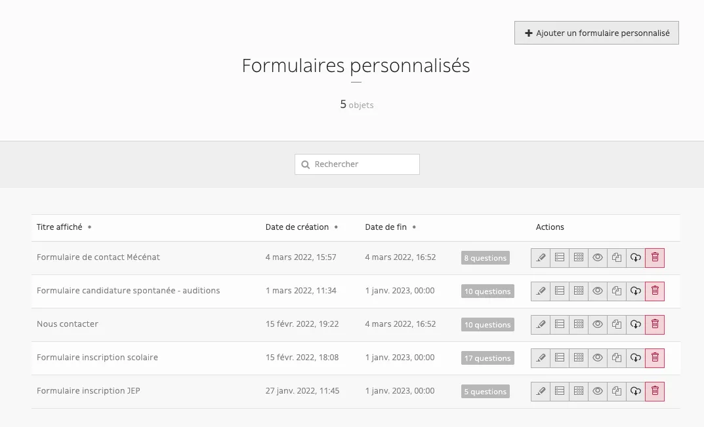

Les boutons d’actions de droite vous permettent de

- editer
- voir les questions
- voir les réponses
- afficher le formulaire (en prévisualisation)
- dupliquer
- exporter
- supprimer

## Créer un nouveau formulaire

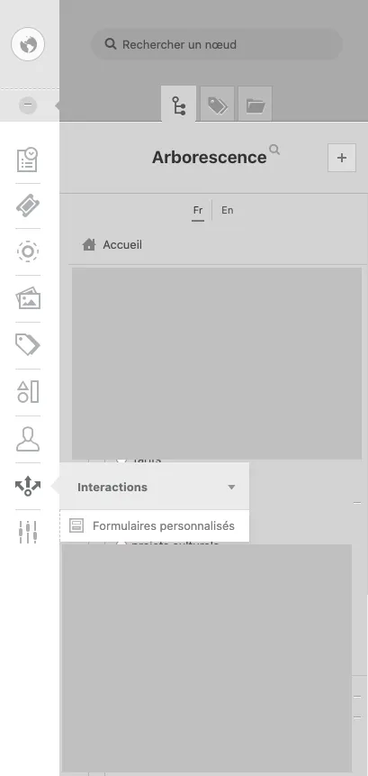

<video controls>
    <source src="/user/formulaires_personnalises/Enregistrement_de_lecran_2024-03-15_a_15.38.46.webm" type="video/webm">
    Your browser does not support the video tag.
</video>

Pour créer un formulaire, il est impératif de lui donner un nom (champ obligatoire). Le **nom du formulaire s’affichera en front**. 
Ne pas renseigner juste “Formulaire” (besoin de préciser le contexte, type “*Contactez le service Mécénat*”).

5 onglets vous permettent de gérer vos formulaires

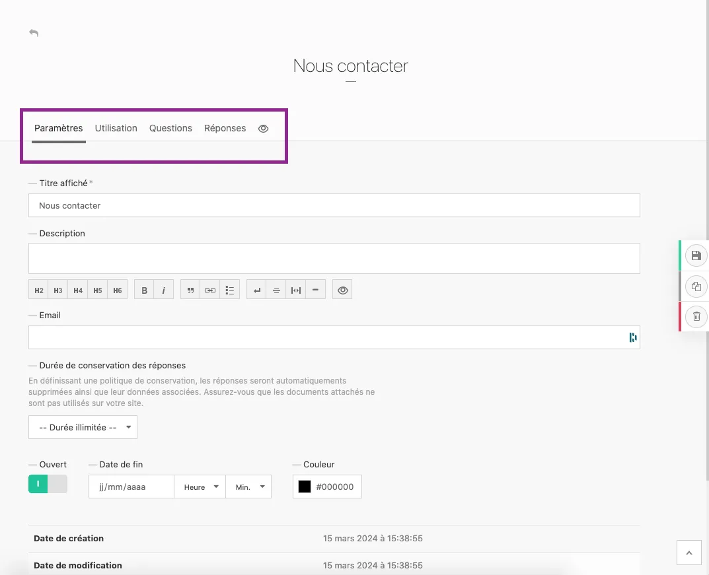

## Paramètres du formulare

### Email de destination

Le mail de destination est également obligatoire. Ce sera le mail qui recevra les résultats du formulaire.

::: tip
💡 Vous avez la possibilité de renseigner plusieurs mails de destination, en les séparant par des virgules
:::

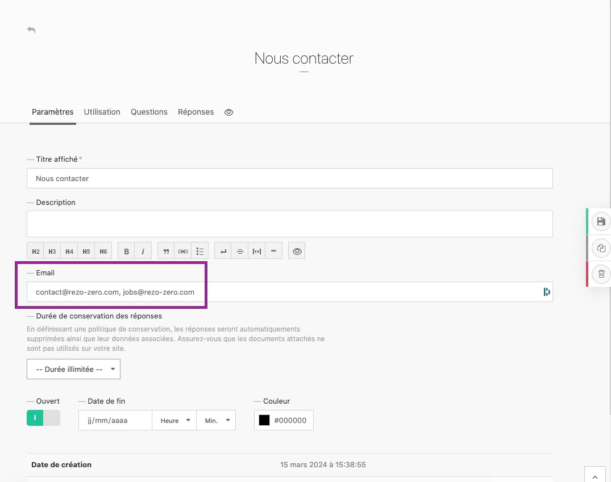

### Autres

Le champ Description et couleur sont facultatifs. 
Vous avez la possibilité de saisir une date de fin du formulaire (date fermeture des inscriptions pas exemple).

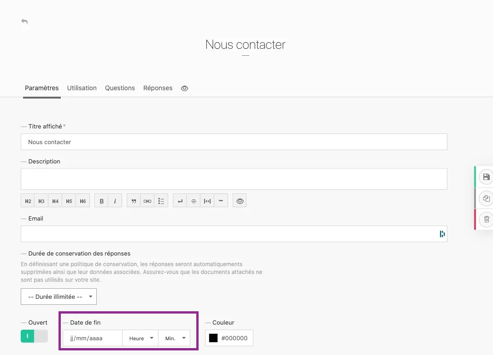

### Durée de conservation - RGPD

Pour vous conformer au RGPD, renseignez une durée de conservation des réponses maximale.

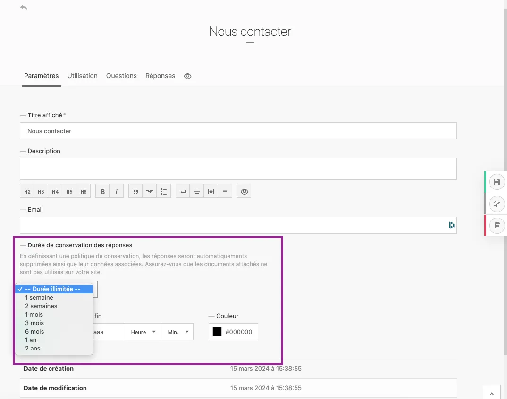

### Bouton “Ouvert”

Ce bouton permet de publier ou dépublier le formulaire (active et desactive l’affichage du formulaire en front)

### Message de succès

Côté utilisateur, une fois que le formulaire est rempli et envoyé, nous pouvons afficher un message de succès, type “Votre message a été envoyé”. 
Ce texte **n’est pas administrable** (hard-codé). Il s’agit d’un message commun à tous les formulaires (non-personnalisable).

::: tip
À noter qu'il n'y a pas de mail de confirmation envoyé automatiquement à la soumission d'un formulaire ; 
le message de succès s'affichera en front, directement sur la page du site concernée.
:::

## Questions du formulaire

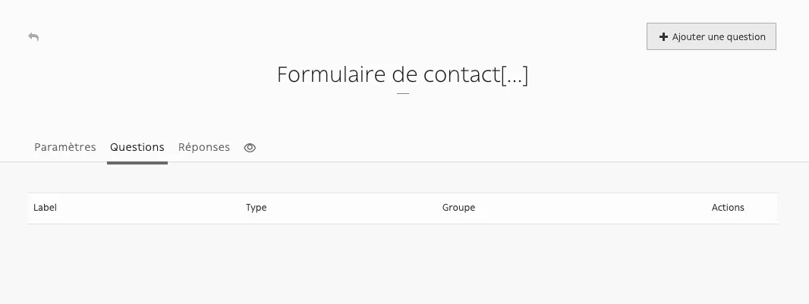

Permet de saisir tous les champs du formulaire. Pour ajouter une question :

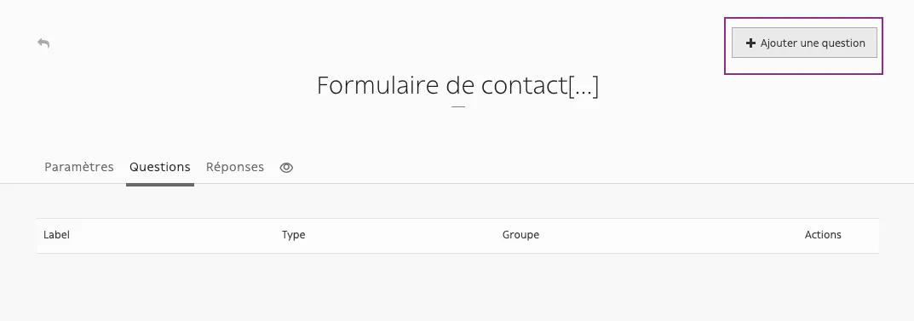

Renseignez les paramètres de la question :

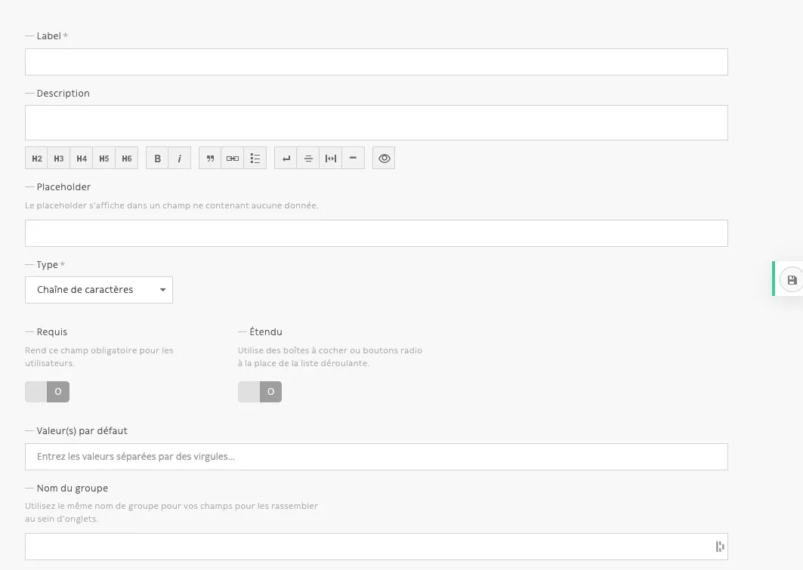

### Label

Champ obligatoire ; il s’agit de l’intitulé que verra l’utilisateur en front

### Description

*Facultatif*: permet d’ajouter une mention à votre question

Exemple dans le back-office:

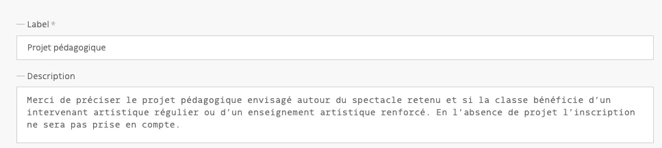

Prévisualisation:

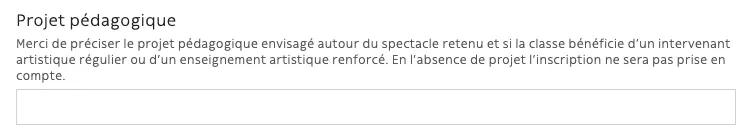

### Placeholder

*Facultatif*: il s’agit d’un item qui sera affiché dans un champ ne contenant aucune donnée. 
Par exemple, pour une liste déroulante, vous pouvez afficher “Sélectionnez” pour les listes déroulantes

### Type

Il s’agit de la typologie de la réponse ; attention cela contraint l’utilisateur à respecter le format renseigné. 
*En cas de doute, laissez par défaut “Chaîne de caractères”, ce qui permettra à l’utilisateur de saisir un texte libre.*

::: tip
💡 Vous avez la possibilité d’afficher une liste déroulante de pays ; il s’agit de la norme ISO 3466-1
:::

### Requis

Active le champ obligatoire

### Étendu

Utilise des boîtes à cocher ou boutons radio à la place de la liste déroulante. Pertinent en cas de listes courtes. 
Pour listes longues, n’activez-pas le bouton étendu

Exemple de liste déroulante :

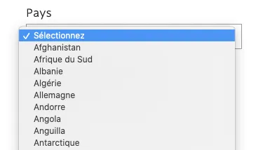

Example de Boutons radio :

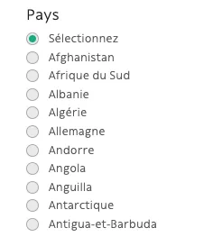

### Valeur(s) par défaut

Permet de mettre en place une liste de choix (pour choix unique ou choix multiple des listes déroulantes et 
boutons radio/cace à cocher). Entrez les valeurs séparés par virgules. Exemple :

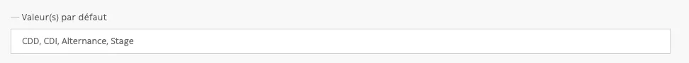

### Nom du groupe

Si votre formulaire est composé d’une seule partie, laissez le champ vide. Si le formulaire comprend plusieurs parties, 
rentrez le nom du groupe pour chaque question.

Exemple dans le back-office:

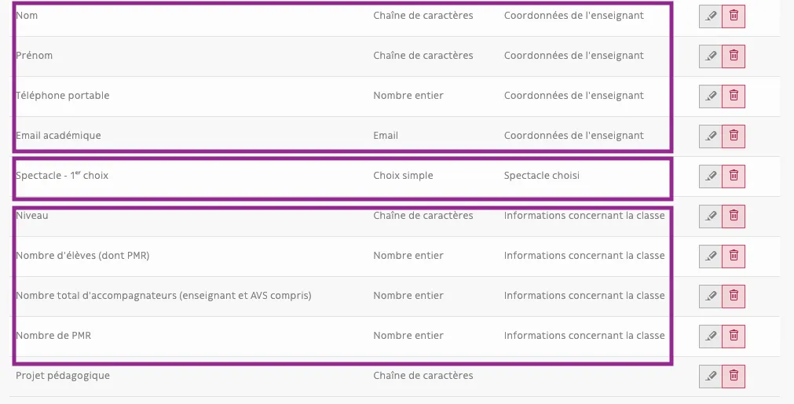

Prévisualisation:

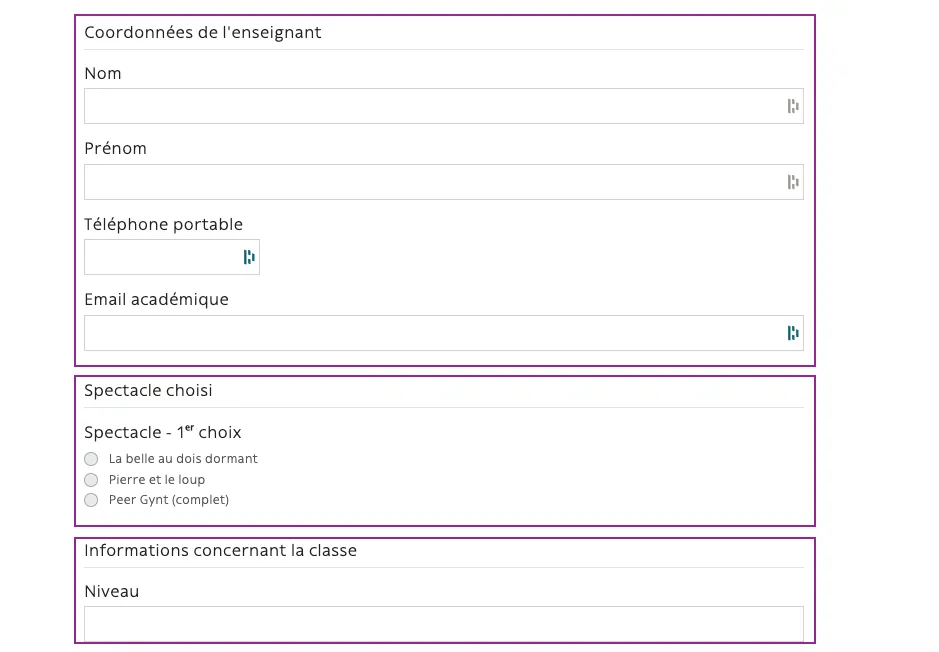

### Ordre de questions

Les questions se placent par ordre de leur création. 

Pour changer l’ordre de questions, utilisez cliquer-déposer :

<video controls>
    <source src="/user/formulaires_personnalises/Enregistrement_de_lecran_2022-03-04_a_16.56.05.webm" type="video/webm">
    Your browser does not support the video tag.
</video>

## Réponses du formulaire

Cet onglet vous permet d’accéder à toutes les réponses reçues et de les exporter.

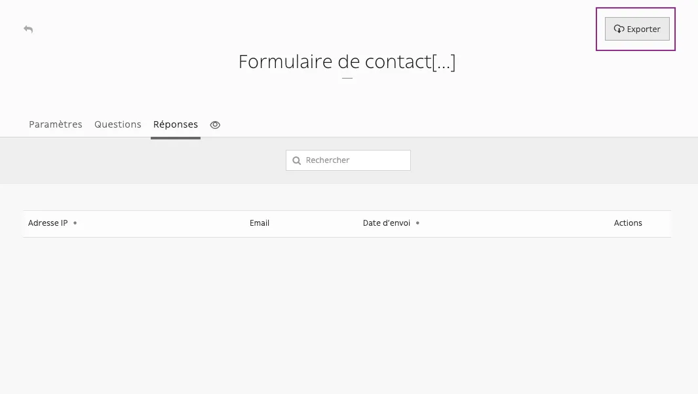

## Prévisualiser le formulaire 👁️‍🗨️

Permet de prévisualiser votre formulaire

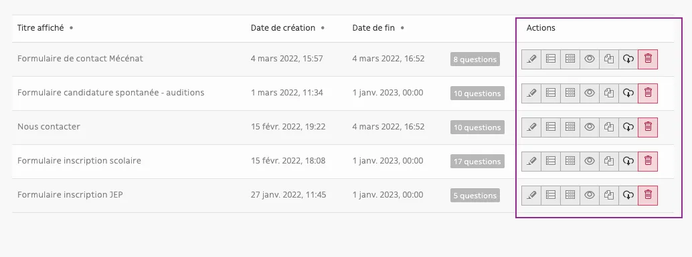

# Intégration d’un Formulaire personnalisé

Vous avez la possibilité d’intégrer un formulaire personnalisé dans un bloc prévu à cet effet.
