# Gérer les comptes

## Accéder à l’espace Utilisateurs

Si vous disposez d’un compte Administrateur, vous avez la possibilité d’accéder à l’espace de gestion des Utilisateurs

L’onglet qui vous permet de visualiser les utilisateurs et d’assurer leur gestion est l’onglet **Utilisateurs.** Par défaut, cet onglet vous propose la liste de tous les utilisateurs, avec l’aperçu de leurs propriétés :

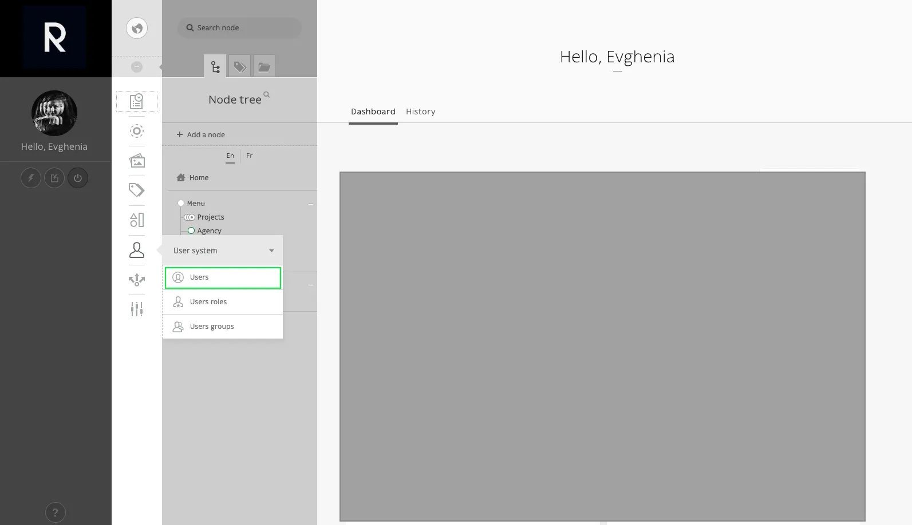

## Ajouter un utilisateur

Pour ajouter un nouvel Utilisateur, renseignez les 4 champs obligatoires (le nom utilisateur peut être l’email de la personne). Cochez obligatoirement l’un des 3 groupes proposés : Admin, Backend user ou Éditeur. Pour des mesures de sécurité, limitez la création de comptes Admin (ce type de compte permet d’accéder à la liste des utilisateurs, avec droit d’ajout, modification et suppression). Le compte le plus commun est Éditeur.

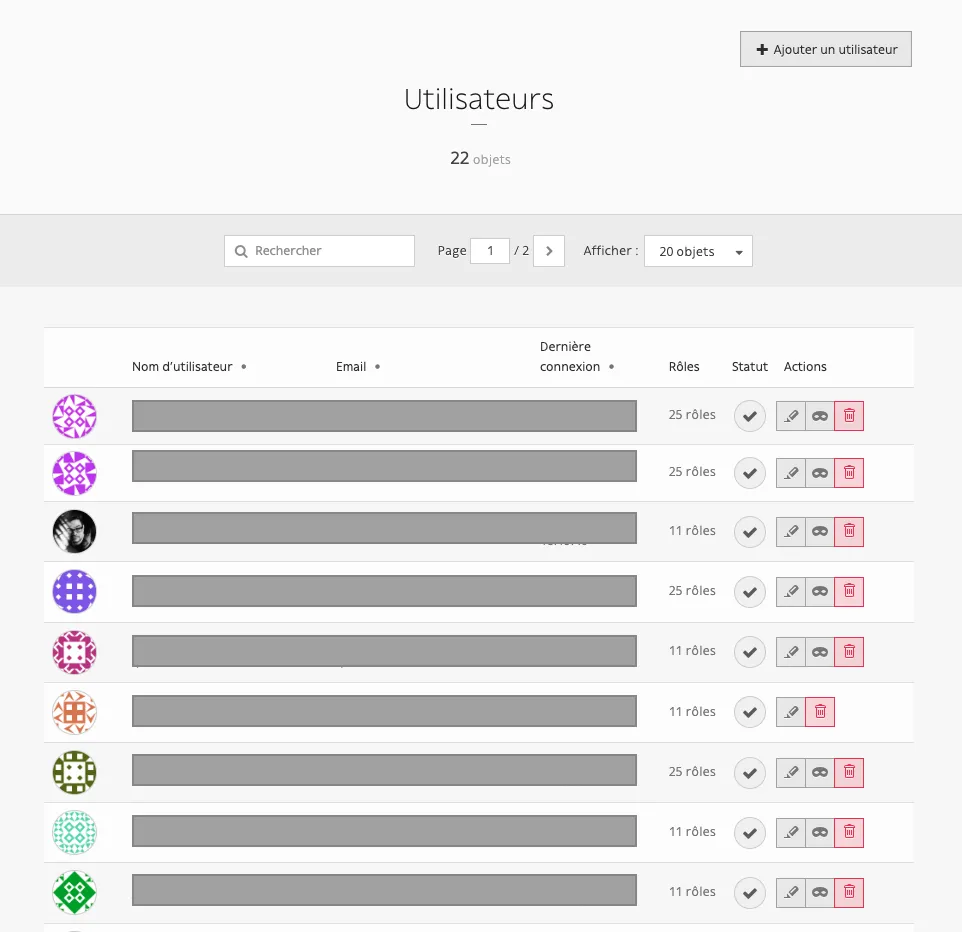

<video controls>
    <source src="/user/gerer_les_comptes/Enregistrement_de_lecran_2022-10-18_a_11.27.30.webm" type="video/webm">
    Your browser does not support the video tag.
</video>

### Mot de passe éphémère

::: tip
💡 Le mot de passe du back-office ne doit en aucun cas être transmis directement à l’utilisateur en question. La personne qui dispose d’un compte doit être la seule à connaître son mot de passe.
:::

Pour des raisons de sécurité, composez un mot de passe aléatoire, et suggérez au nouvel utilisateur de cliquer sur “Mot de passe oublié” lors de sa première connexion, afin qu’il puisse créer son propre mot de passe.

Si vous créez un compte utilisateur sans spécifier son mot de passe, un email avec un lien de réinitialisation du mot de passe lui sera envoyé automatiquement. Le lien de création de mot de passe, reçu sur sa messagerie, sera valable 10 minutes. Si l’utilisateur n’a pas créé son mot de passe dans le temps imparti (10 min), son compte sera verrouillé. 

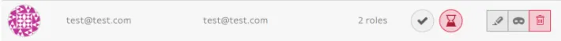

Néanmoins il aura la possibilité de cliquer sur “Mot de passe oublié” pour en créer un. 

## Supprimer un utilisateur

Pour supprimer un utilisateur, il suffit de cliquer sur l’icone rouge et confirmer la suppression : 

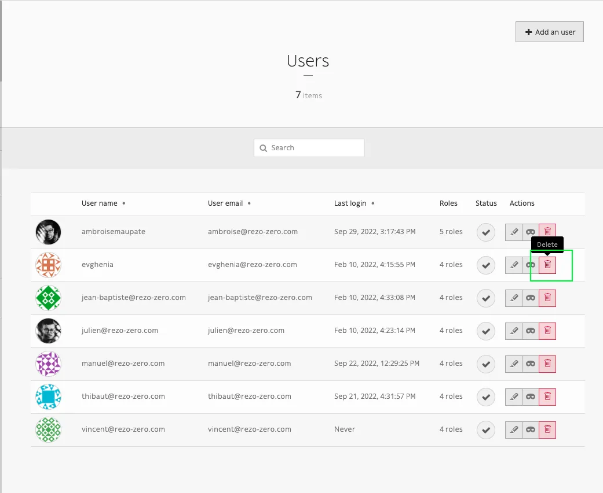

## Éditer un compte

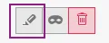

L’icône **crayon** vous permet d’accéder à toutes les informations du compte.

### Informations

Permet de visualiser ou modifier les informations relatives à la connexion d’un compte (nom utilisateur, mail, mot de passe)

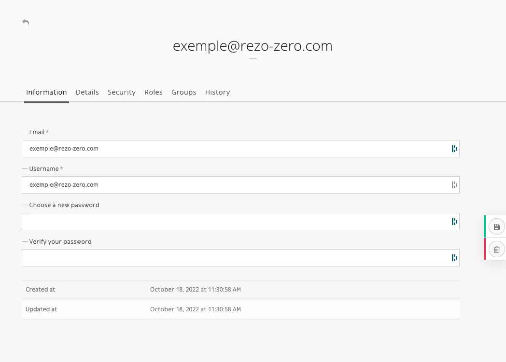

### Détails

Les champs renseignés dans cet onglet sont complemetemnt optionnels. Vous pouvez les laisser vides par défaut

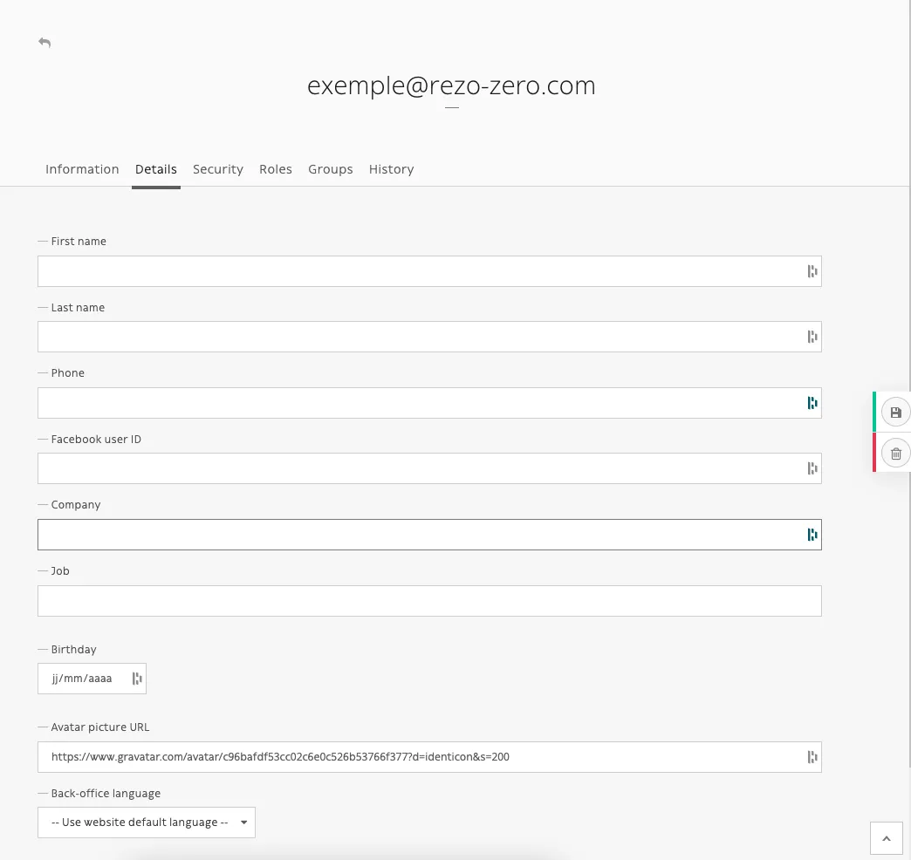

### Sécurité

Les paramètres de cet onglet permettent de gerer l’activation et desactivation d’un compte (comme par exemple, forcer l’expiration)

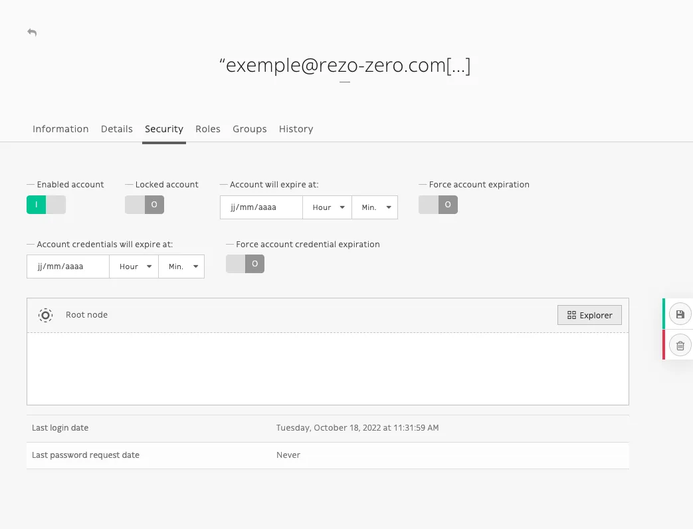

### Rôles

L’onglet Rôles vous permet de visualiser les rôles (droits) de l’utilisateur, liés à son type de compte (Admin, Éditeur ou Backed user).

::: tip
💡 IMPORTANT : si nombre de rôles est important, cela ne signifie pas que l’utilisateur posséde plus de droits. Par exemple, un Admin possède 10 rôles, un Éditeur en a 24. Il y a des rôles qui englobent plusieurs rôles/droits, c’est la raison pour laquelle il existe cet écart entre le nombre de rôles.
:::

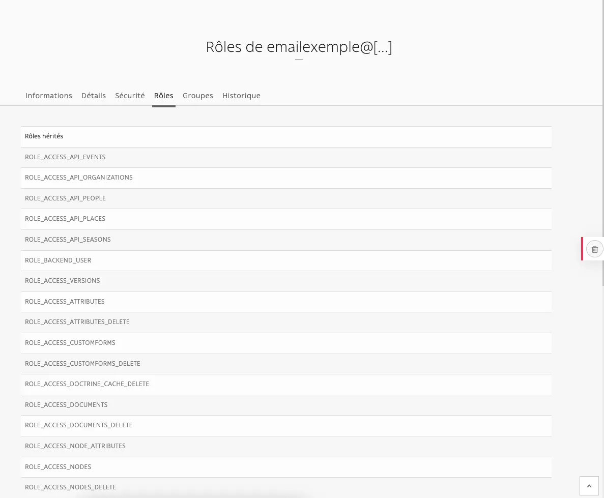

Dans cet onglet, vous pouvez ajouter un rôle spécifique, si les rôles attribués à la création de compte ne sont pas suffisants :

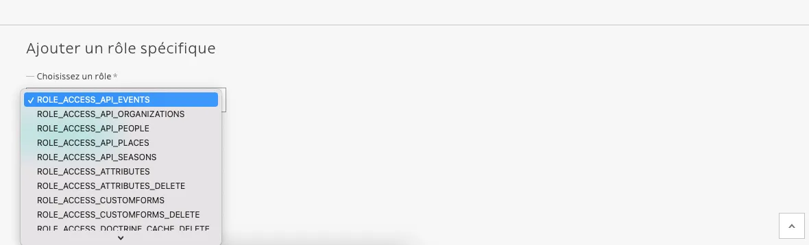

### Groupes

Cet onglet vous permet de visualiser à quel type d’utilisateur appartient le compte (Admin, éditeur ou back-end user)

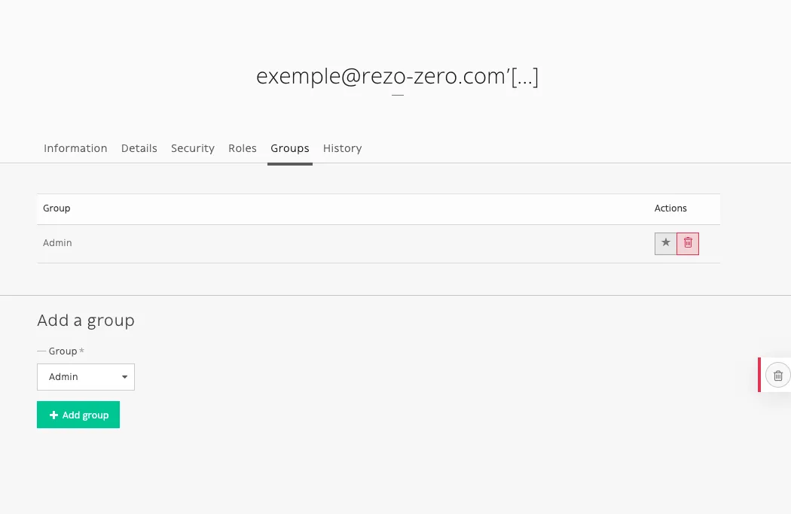

::: tip
💡 Vous pouvez changer le type de groupe (de éditeur à admin ou de back-end user à éditeur par exemple). Attention, il faut toujours ajouter le nouveau groupe avant de supprimer l’ancien.
:::

<video controls>
    <source src="/user/gerer_les_comptes/Enregistrement_de_lecran_2022-10-18_a_11.33.59.webm" type="video/webm">
    Your browser does not support the video tag.
</video>

### Admin

::: tip
💡 Ce groupe possède tous les rôles/droits dans le back-office ; le compte Admin permet notamment d’ajouter / supprimer / modifier les utilisateurs. Le nombre d’administrateurs du site est donc à limiter (accorder ce groupe uniquement aux personnes responsables du site ; par précaution, ne pas donner les accès Admin aux individus externes de votre structure).
:::

### Éditeur

Le compte éditeur peut créer, éditer, publier supprimer, déplacer les contenus. Il n’a pas accès à l’onglet “Système d’utilisateurs”.

### Back-end user

Il s’agit d’un compte qui permet simplement de se connecter au back-office, sans avoir aucun droit d’édition, navigation ou même consultation de nœuds du CMS. 

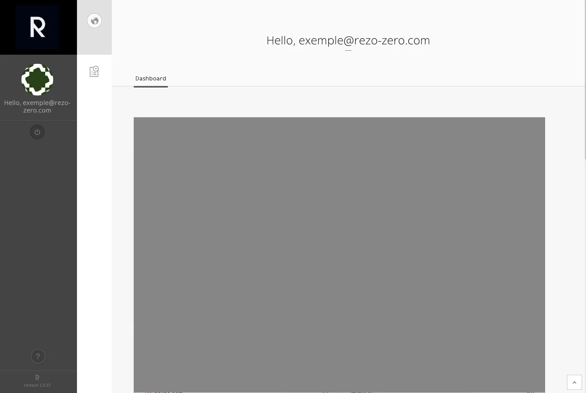

### Historique

Permet d’afficher les modifications réalisées par l’utilisateur, par ordre antéchronologique

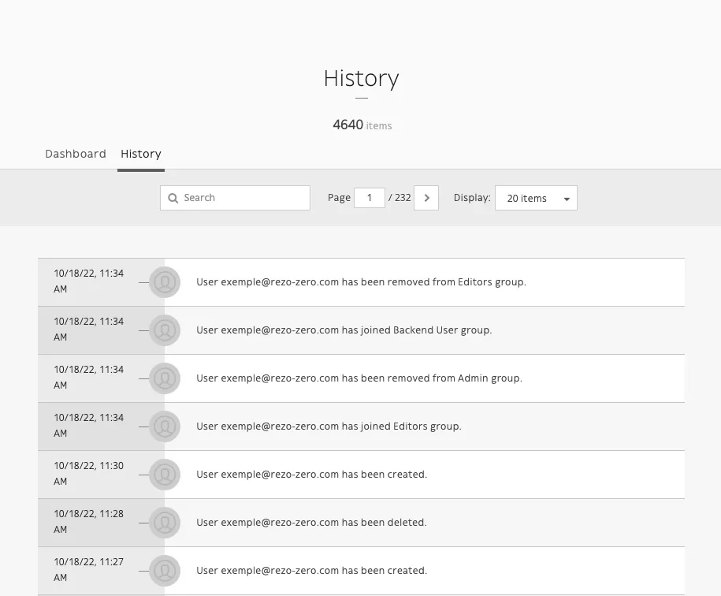

## Prendre les privilèges

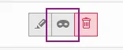

Votre back-office vous permet de “prendre les privilèges” d’un utilisateur ; cela veut dire qu’en cliquant sur l’icône “masque” vous pouvez visualisez ce que l’utilisateur en question voit en se connectant au CMS. 

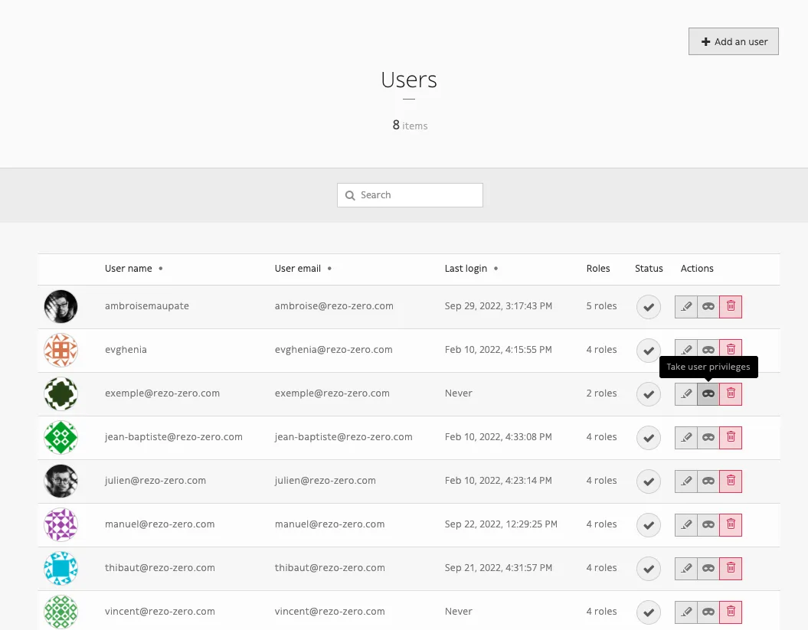

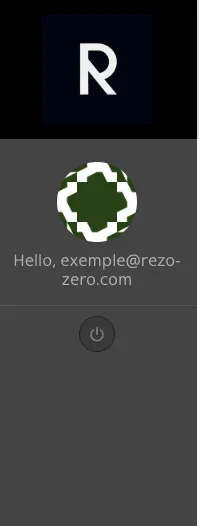

Cette fonctionnalité est notamment utile dans le cas ou vous ajoutez ou supprimez des rôles d’un utilisateur, pour vérifier la prise en compte des changements. 

Pour revenir à votre compte (annuler la prise des privilèges), il suffit de cliquer sur le bouton déconnexion. 

## Transmission d’informations pour première connexion du nouvel utilisateur

Lorsque le nouveau compte est créé par vos soins, il est nécessaire de transmettre les informations de connexion au nouvel utilisateur en question. 
Transmettez (par email par exemple) le lien de connexion vers le back-office. 

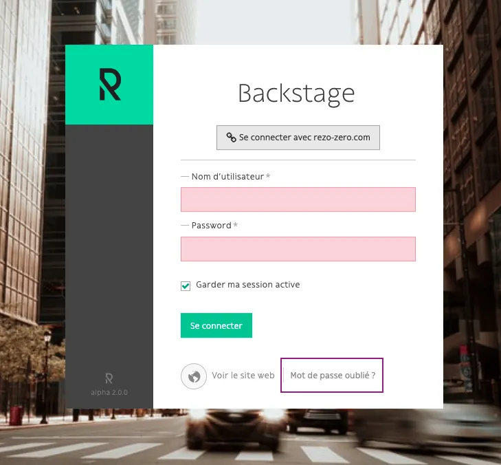

Lors de sa première connexion, l’utilisateur devra cliquer sur “Mot de passe oublié”.

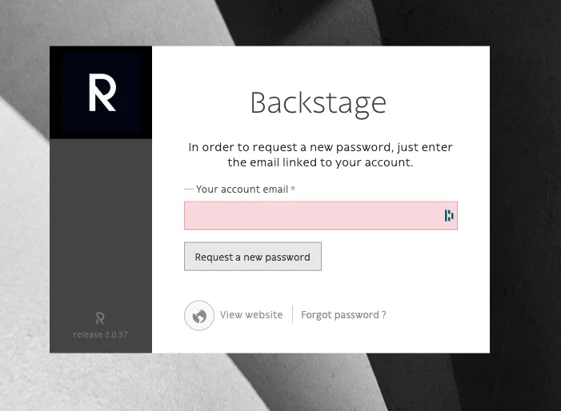

Il faudra alors renseigner l’email lié à ce compte afin que l’utilisateur puisse recevoir un lien de création de mot de passe sur sa messagerie. 

Pour plus de détails, référez vous à [Mot de passe éphémère](#mot-de-passe-ephemere)
