# Gérer les médias

Vous pouvez gérer les divers médias via l’icône **Documents** dans la barre d’outils. Vous pouvez téléverser, intégrer des documents externes, et même jeter un coup d’œil aux documents inutilisés de votre site Web.

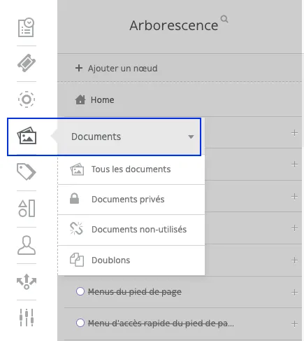

## Intégrer un fichier dans le back-office

### Téléverser

Pour déposer un fichier dans votre CMS, cliquez sur le bouton téléverser ; un espace de téléversement s’ouvrira ; vous pouvez cliquer sur la zone grise pour activer un onglet qui vous permet de sélectionner le média stocké sur votre machine. Le document téléversé se retrouvera automatiquement en première position de votre onglet Documents :

<video controls>
    <source src="/user/gerer_les_medias/Enregistrement_de_lecran_2023-03-28_a_13.42.16.webm" type="video/webm">
    Your browser does not support the video tag.
</video>

### Intégrer

Vous pouvez également importer un média depuis une plateforme. C’est notamment le cas pour les vidéos.

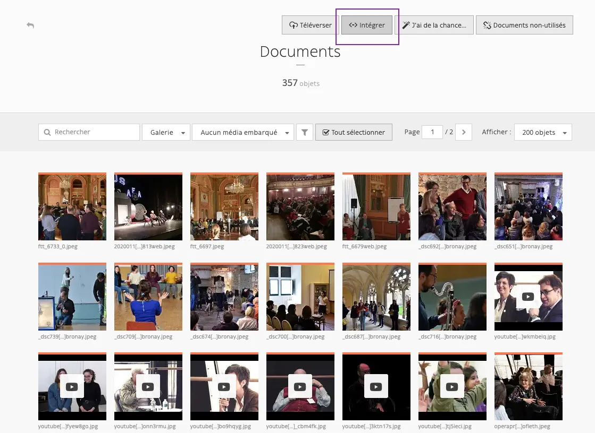

Une liste de plateformes est disponible dans votre CMS ; attention, uniquement les plateformes compatibles avec
votre projet sont paramétrées en front-office, selon le cahier des charges défini. Saisissez l’URL du média et
sélectionnez la plateforme correspondante, puis sauvegardez (bouton Intégrer). Le média sera placé en première position de vos Documents :

<video controls>
    <source src="/user/gerer_les_medias/Enregistrement_de_lecran_2023-03-28_a_13.44.42.webm" type="video/webm">
    Your browser does not support the video tag.
</video>

### J’ai de la chance

**J’ai de la chance** est une fonctionnalité bien pratique qui permet de télécharger des documents au hasard sur 
votre site à partir de la base libre de *Unsplash*.

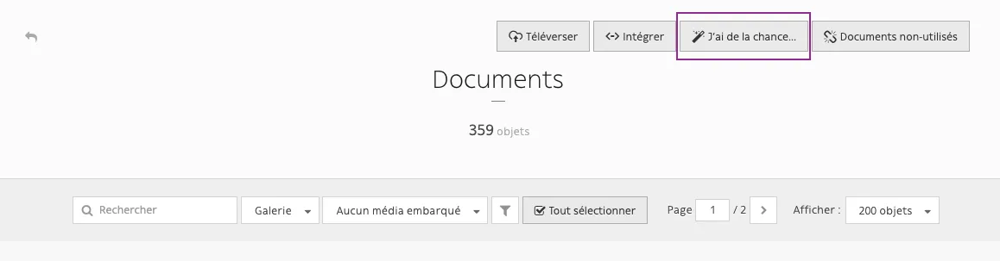

## Documents non-utilisés

En cliquant sur **Documents inutilisés**, vous pourrez vérifier la liste de toutes les sources non référencées sur votre site,
ce qui vous permettra par la suite de nettoyer votre base de données et de supprimer ainsi des fichiers inutiles.

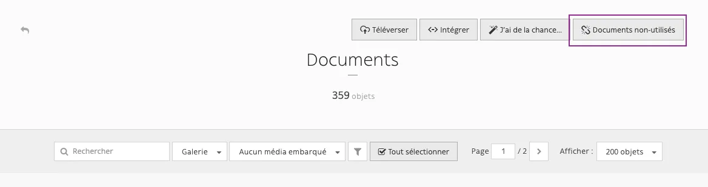

## Intégrer une image ou vidéo dans un champ

Le fonctionnement d’intégration d’une image pour un header de page ou un bloc de contenu est le même : il s’agit de remplir le champ correspondant. 

Pour remplir un champ avec une image, vous pouvez 

- soit téléverser une image (qui n’est pas encore dans votre back-office)
- soit sélectionner une image stockée dans votre CMS, téléversée précédemment

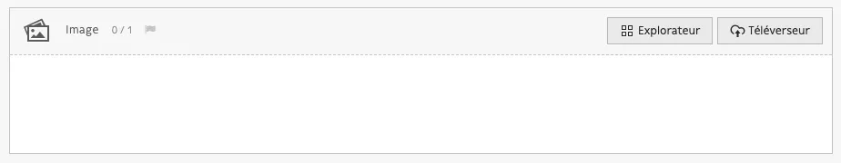

### Téléverser

Cliquez sur le bouton téléverser pour ouvrir la zone active d’upload.

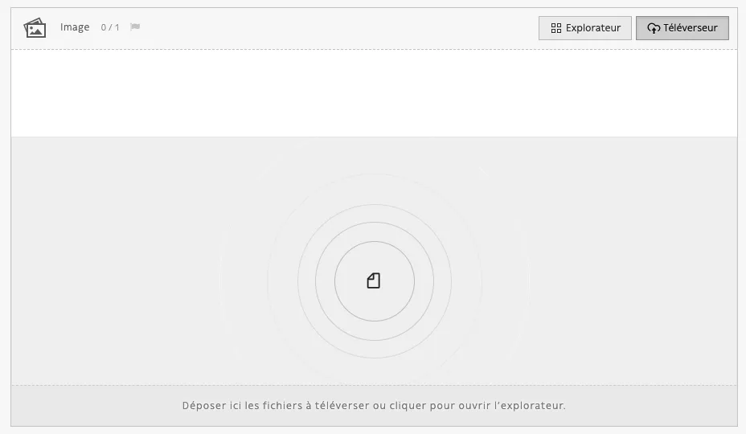

Déposez les fichiers à téléverser ou cliquez pour ouvrir l’explorateur (cf. la vidéo tuto [Gérer les fichiers (images, vidéos, documents) - SUPP](https://www.notion.so/G-rer-les-fichiers-images-vid-os-documents-SUPP-a23dd67b881245fa88dd8998b5de05c6?pvs=21)).

### Explorateur

Cliquez sur le bouton Explorateur.

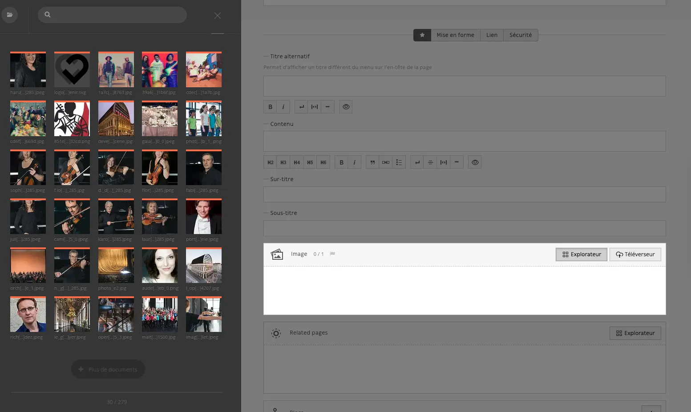

Sélectionnez le ou les fichiers souhaités en cliquant dessus.

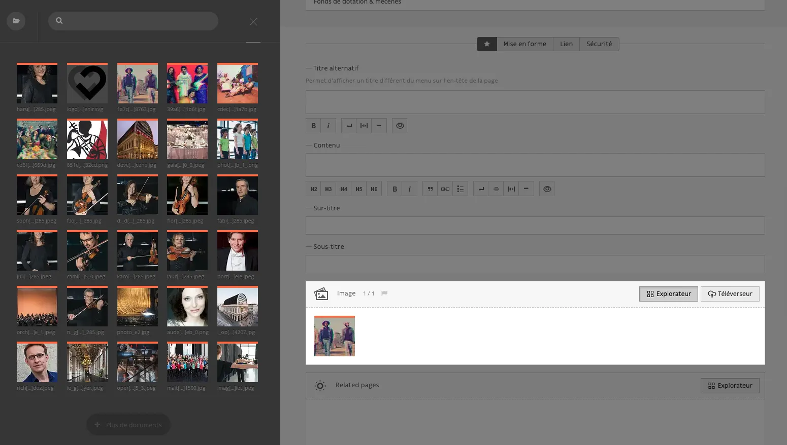

Refermez l’explorateur (croix ou bouton Explorateur) et sauvegardez votre saisie :

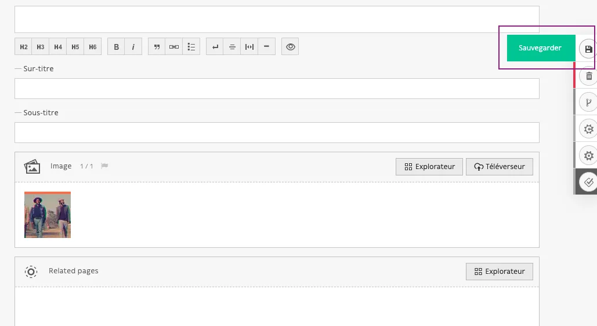

## Images

Votre CMS permet d’afficher plusieurs formats d’images : jpeg, png, svg.
De manière générale, privilégiez le format jpeg. Utilisez la meilleure qualité possible pour vos images, néanmoins leur poids ne doit pas dépasser 2 Mo.
Pour les fichiers qui nécessitent une transparence (logos, images sur fond coloré, infographies), utilisez le format png transparent ou svg. Sinon, privilégiez le format jpeg.

::: danger
Ne pas utiliser les fichiers source type .psd, .ai ou .tiff, ils ne seront pas affichés sur le site.
:::

### Édition

L’onglet édition est l’onglet par défaut sur lequel vous arrivez dans votre parcours de gestion des médias. C’est par ailleurs dans cet endroit que vous pouvez télécharger le fichier sur votre machine :

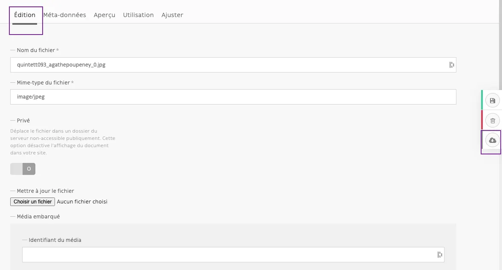

Tout en bas de la page vous trouverez l’URL publique et le chemin absolu du fichier.

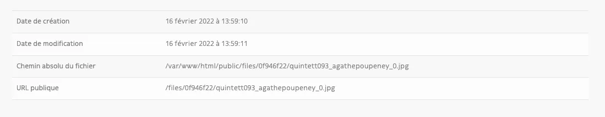

### Méta-données

L’onglet méta-données est prévu pour plusieurs fonctionnalités :

- afficher le nom du fichier
- intégrer sa description
- afficher le copyright
- pouvoir intégrer un lien externe (si votre image est prévue en tant qu’item cliquable)

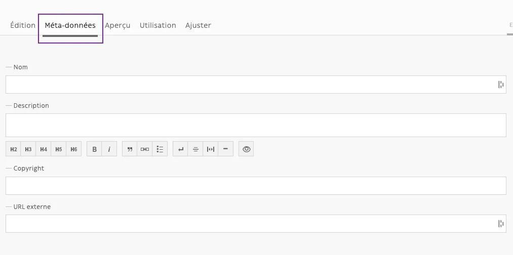

### Aperçu

L’onglet Aperçu vous permet de visualiser l’image.

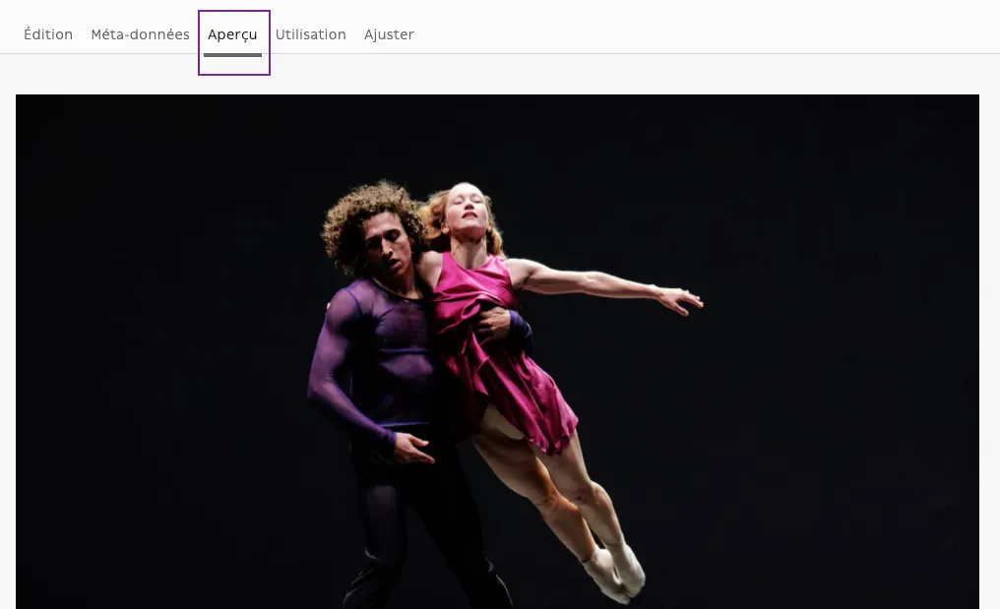

De même, cet onglet vous permet de récupérer les informations relatives au fichier (taille, largeur, hauteur etc.) :

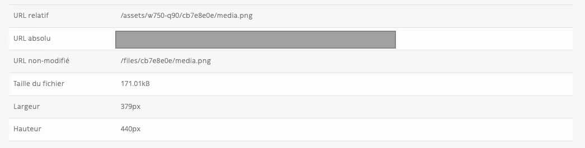

Important : c’est à cet endroit que vous pouvez récupérer l’URL absolue de votre fichier. Cette URL peut être partagée ou intégrée dans un lien hypertexte.

Pour les images, privilégiez l’URL non modifiée.

Depuis cet onglet vous pouvez également télécharger votre fichier sur votre machine : 

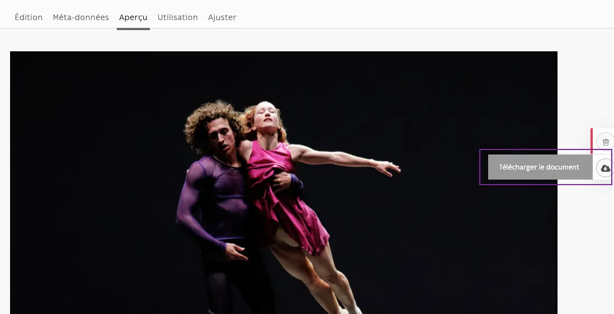

### Utilisation

L’onglet Utilisation vous permet de voir dans quels blocs ou endroits du site est utilisé ce fichier ; en cliquant sur la ligne correspondante, vous serez redirigé automatiquement vers le nœud/bloc qui contient votre fichier :

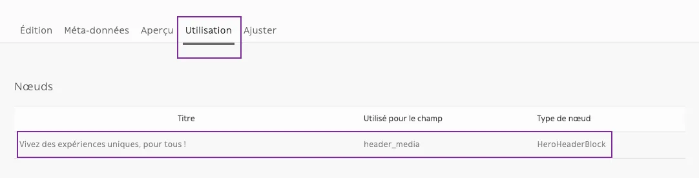

### Ajuster

L’onglet Ajuster vous permet d’éditer votre image ; il ne s’agit pas d’un traitement graphique, mais uniquement des ajustements de position, zoom, recadrage.

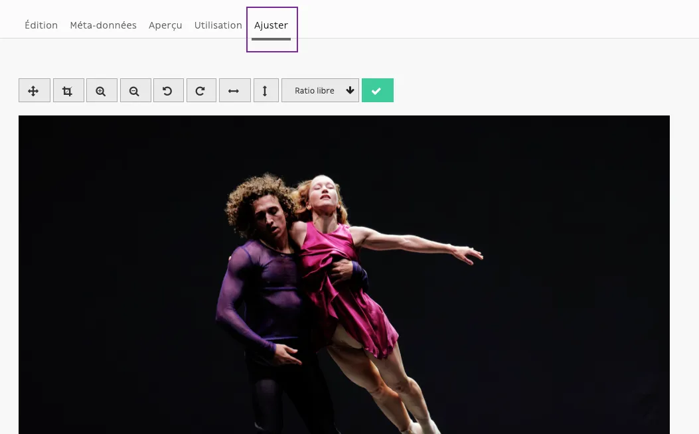

#### Recadrage

Pour rogner une photo, vous pouvez choisir le ratio souhaité (libre ou prédéfini) :

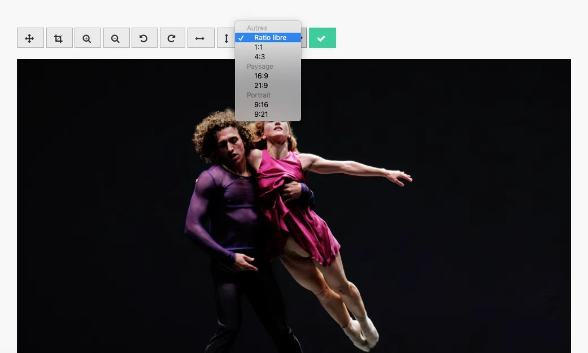

Une fois le ratio défini, sélectionnez la zone souhaitée et appuyez sur le bouton vert :

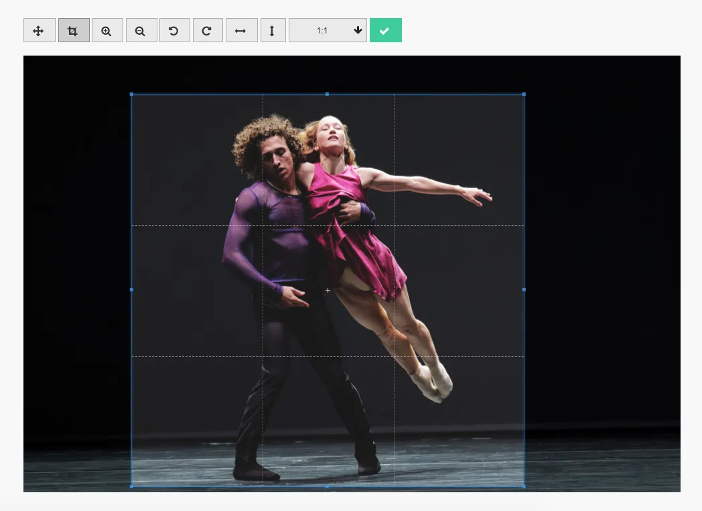

Le back-office vous proposera d’appliquer et écraser le fichier ; attention, cela veut dire que le changement sera opéré sur tous les endroits du site où l’image est utilisée :

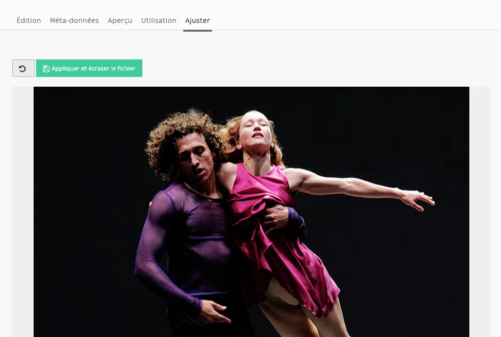

D’autres boutons vous permettent d’effectuer des changements sur l’image :

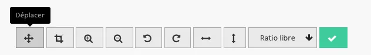

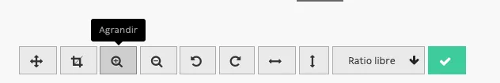

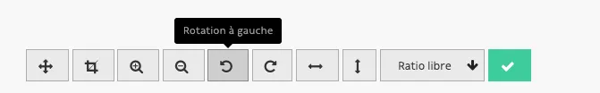

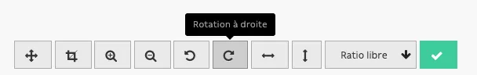

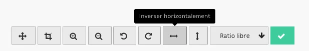

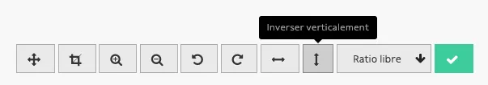

## Vidéos

Votre CMS vous permet d’afficher les vidéos mp4 ainsi que les vidéos lues depuis les plateformes de streaming, type **YouTube** ou **Vimeo**.

À noter que pour respecter les bonnes pratiques web, les fichiers mp4 sont à utiliser avec parcimonie : en effet, le poids d’une vidéo peut jouer sur l’expérience utilisateur ; si une vidéo dépasse 2 Mo, elle est considérée comme trop lourde ; la page sera donc chargée avec beaucoup de difficultés, surtout en cas de mauvaise connexion Internet. 

Pour des vidéos longues, privilégiez les plateformes de streaming.

Pour les vidéos courtes (type boucle vidéo, sans son), vous pouvez téléverser le fichier directement dans le back-office.

::: warning
💡 L’utilisation de fichiers vidéo directement dans le back-office nécessite des connaissances en encodage vidéo et une bonne configuration des codecs compatibles pour le web : tels que H.264 et/ou VP8 dans les conteneurs MP4 et/ou WebM.
:::

### Édition

Dans l’onglet édition, vous trouverez un champ nommé Vignettes :

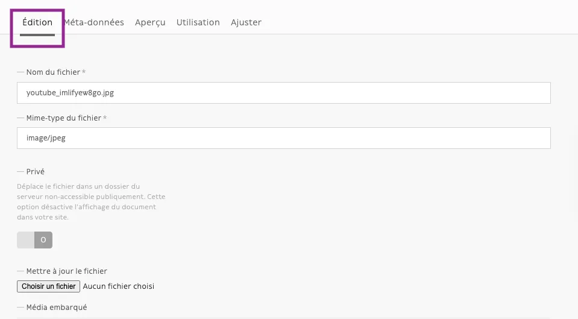

#### Vignette de vidéo

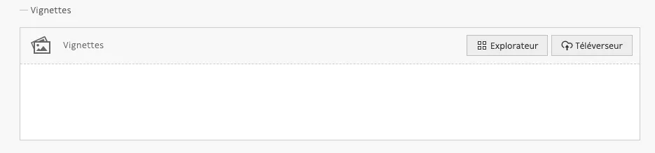

Par défaut, le back-office prendra une image d’arrêt sur votre vidéo, ou la vignette définie dans YouTube ou Vimeo. Néanmoins, elle peut être personnalisée. Vous pouvez donc déposer dans ce champ une image qui sera affichée en vignette sur votre vidéo sur votre site.

Il en est de même pour les fichiers mp4.

#### Gestion d’une vignette vidéo : pas à pas

Si vous disposez d’une image qui correspondrait à la vignette de vidéo, vous pouvez la téléverser dans le back-office et l’utiliser. Si vous n’avez pas d’image prévue pour la vignette, vous pouvez effectuer une capture d’écran (image d’arrêt) qui servira de vignette.

Exemple : depuis YouTube, assurez-vous de toujours afficher la meilleure qualité d’image et effectuez la capture :

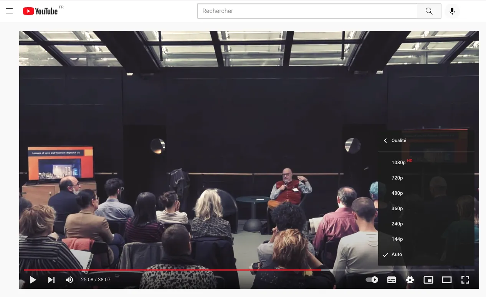

Une fois que votre image est prête, téléversez le fichier dans le champ Vignette :

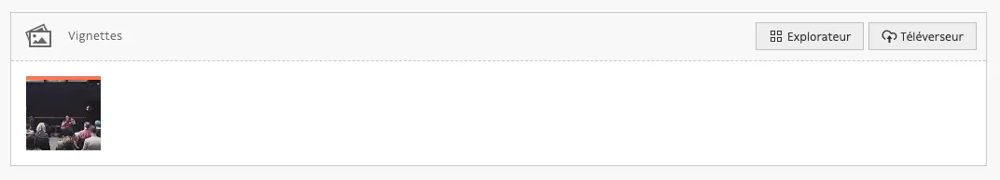

Dans l’onglet Aperçu, vous allez pouvoir remarquer le remplacement de l’image :

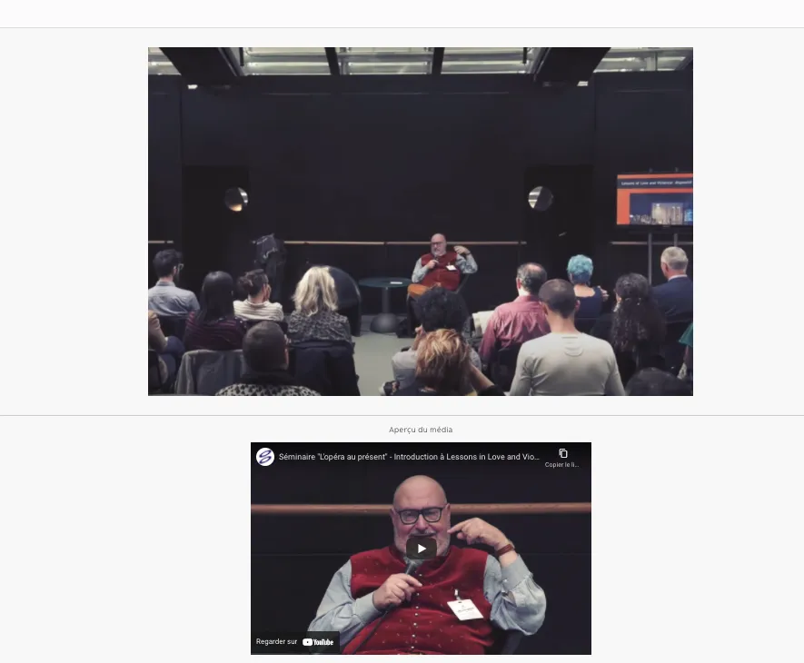

Idem sur la vue générale de votre rubrique Documents : 

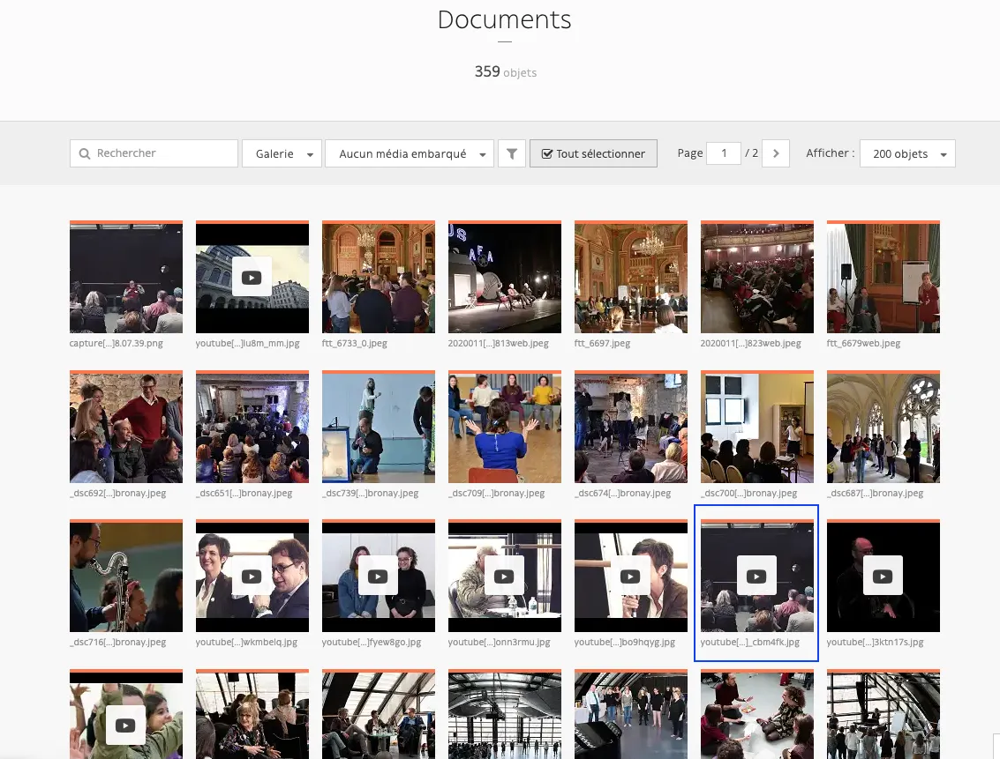

#### Gestion d’une vignette vidéo : tuto capture vidéo

**Étape 1 : intégration dans CMS**

<video controls>
    <source src="/user/gerer_les_medias/Enregistrement_de_lecran_2023-04-05_a_15.20.20.webm" type="video/webm">
    Your browser does not support the video tag.
</video>

**Étape 2 : intégration dans une galerie**

<video controls>
    <source src="/user/gerer_les_medias/Enregistrement_de_lecran_2023-04-05_a_15.26.19.webm" type="video/webm">
    Your browser does not support the video tag.
</video>

**Étape 3: ajout de la vignette**

<video controls>
    <source src="/user/gerer_les_medias/Enregistrement_de_lecran_2023-04-05_a_15.29.01.webm" type="video/webm">
    Your browser does not support the video tag.
</video>

**Exemple Rendu avec la vignette :**

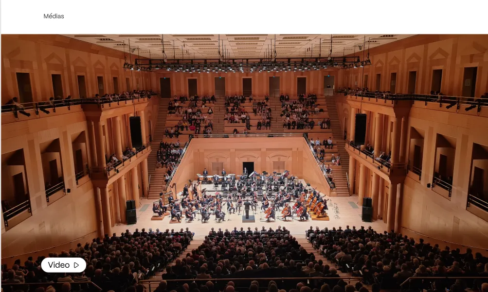

### Autres onglets de gestion

Pour les onglets Méta-données, Aperçu, Utilisation et Ajuster, consultez le chapitre ci-dessus (il s’agit du même fonctionnement pour les images et pour les vidéos).

## Documents PDF

Pour la gestion des documents PDF, consultez le tutoriel de la rubrique Image (même fonctionnement).

## Pictos

Pour intégrer des pictos dans des champs prévus à cet effet, privilégiez le format **svg**, ou bien **png** transparent.

Certains pictos sont entrés dans le code et ne sont pas administrables, c’est notamment le cas des pictos réseaux sociaux (généralement placés dans le footer).

## Logos

Pour les logos, privilégiez le format png transparent ou SVG.

Pour rendre un logo cliquable (pourvoir envoyer l’utilisateur vers le site de l’organisme en question), remplissez les méta-données :

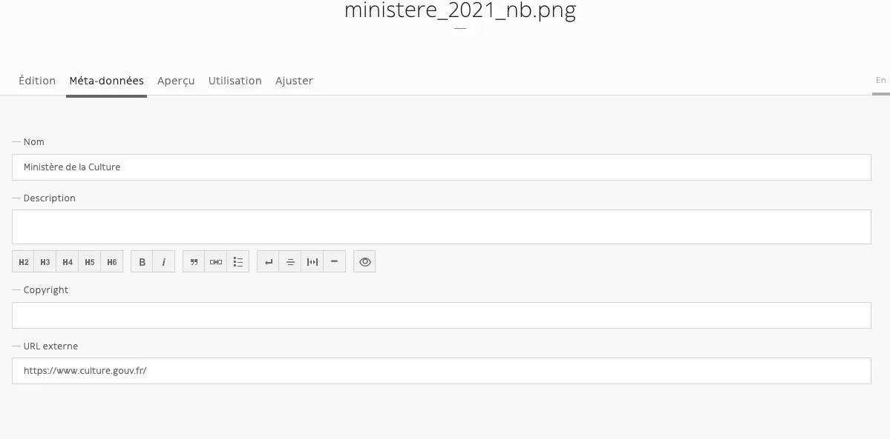
