# Syntaxe Markdown

::: tip
📖 Markdown est un langage de balisage léger avec une syntaxe en texte brut conçue pour être facilement traduite en HTML et bien d’autres formats. Le but de Markdown est de rester lisible tel quel sans donner l’impression qu’il a été marqué par des balises ou des instructions de formatage, contrairement au Rich Text Format (RTF) ou HTML qui utilisent des balises et instructions de formatage empêchant leur lecture par un(e) non-spécialiste.

— *Article sur Wikipédia — [https://fr.wikipedia.org/wiki/Markdown](https://fr.wikipedia.org/wiki/Markdown)*
:::

**Accès rapide**

**Introduction**

Dans votre back-office, le Markdown peut être utilisé dès que vous identifiez les boutons de contrôle pour un contenu textuel :

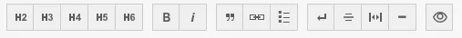

Le Markdown ne doit pas être utilisé dans les titres, sous-titres ou tags, par exemple.

Son utilisation est prévue pour le traitement des textes, le plus souvent champ Contenu. 

## **Gras**

Insérez deux étoiles `**` au début et à la fin du texte pour le mettre en gras, par exemple :

`**Ceci est un texte en gras.**` Ceci est un texte classique.

Le bouton du back-office permet d’insérer directement les deux étoiles autour du texte sélectionné :

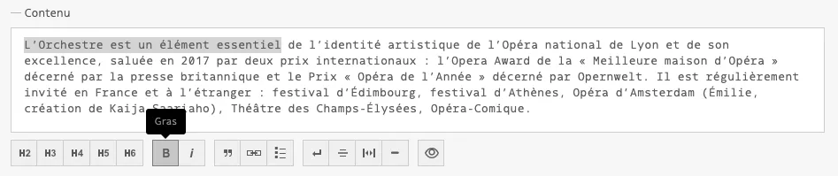

Attention à ne pas laisser d’espace à l’intérieur du groupe d’étoiles (de la même manière qu’avec les parenthèses) sinon le formatage ne s’appliquera pas.

## **Italique**

Insérez une étoile `*` au début et à la fin du texte pour le mettre en italique.

`*Ceci est un texte en italique.*` Ceci est un texte classique.

Le bouton du back-office permet d’insérer directement les deux étoiles autour du texte sélectionné.

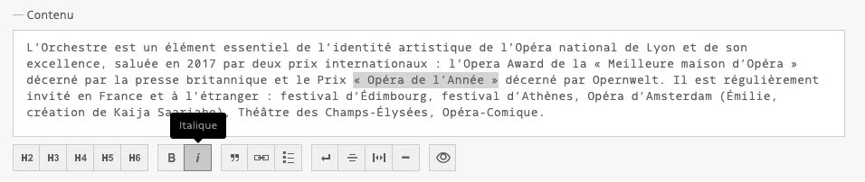

## Gras et italique

Les syntaxes gras et italiques peuvent bien sûr être combinées à l’aide de trois étoiles au début et à la fin du texte sélectionné.

`***Ceci est un texte en gras et italique.***` Ceci est un texte classique.

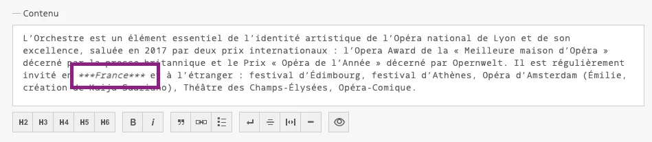

**Et si le caractère * est déjà utilisé dans mon texte ?**

Le gras et l’italique peuvent être formatés de la même manière avec le caractère tiret-bas `_` si votre texte contient déjà le caractère étoile `*`.

Ceci est un texte qui comprend une * dans son message. Je vais donc utiliser `_**un underscore.**_`.

## **Nouveau paragraphe et retour-chariot**

Un simple retour à la ligne est toujours ignoré par Markdown car il fait la différence entre un paragraphe et un retour-chariot (retour à la ligne). Pour créer un retour à la ligne forcé sans changer de paragraphe, laissez au minimum 3 espaces à la fin de votre ligne de texte et allez à la ligne.

```markdown
Adresse :<espace><espace><espace> 
numéro et nom de rue<espace><espace><espace>
Code postal<espace><espace><espace>
Pays
```

::: tip
💡 Vous pouvez aussi utiliser le caractère `backslash` : `\`
:::

```markdown
Adresse : \ 
numéro et nom de rue \
Code postal \
Pays
```

Votre back-office dispose d’un bouton qui vous permet d’insérer un retour-chariot en un seul clic :

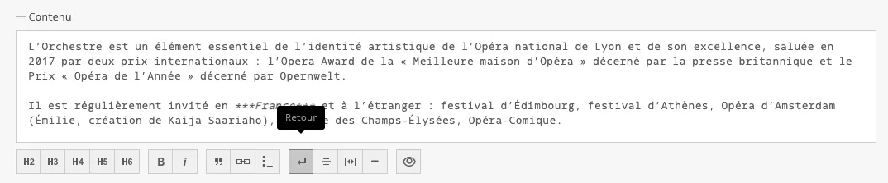

## **Liens hypertextes**

Écrivez le label du lien entre crochets suivi immédiatement de l’URL entre parenthèses.

**Pour les liens externes**, attention à ne pas oublier le préfixe du protocole `http://` ou `https://`.

```markdown
[Nom de mon lien](https://www.mon-site.com)
```

Votre back-office dispose d’un bouton qui vous permet d’insérer la syntaxe markdown en un seul clic :

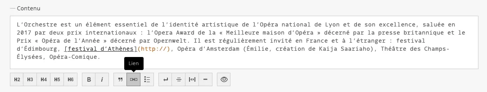

Insérez le lien souhaité à l’intérieur des parenthèses.

**Pour un lien interne**, il faut utiliser la notation relative (supprimer la partie nom de domaine et commencer par le slash) :

```markdown
[Contactez notre équipe](/contactez-nous)
```

**Pour un lien d’email**, préfixer l’URL avec `mailto:` :

```markdown
[Nom Prénom](mailto:nomprenom@gmail.com)
```

**Pour un lien téléphone**, préfixer l’URL avec `tel:` :

```markdown
[+33 9 72 28 04 34](tel:+33972280434)
```

**Un titre de lien** peut être ajouté en l’insérant avant la parenthèse fermante, entouré de guillemets :

```markdown
[Nom de mon lien](https://www.mon-site.com “Site web de l’organisme”)
```

## Espace insécable

L’espace insécable est à placer toujours (dans la mesure du possible) devant les symboles `; : ? !`.
Ainsi que pour les symboles `( ) [ ]` et guillemets français `« »`.
Par exemple : Ceci est une phrase comprenant des « symboles ».

L’utilisation de l’espace insécable est très importante dans les titres des pages (pour éviter qu’un mot ou un symbole se retrouve seul à la ligne).

::: tip
💡 Sur macOS : vous pouvez faire une espace insécable avec le raccourci `Alt + Espace`.
:::

::: tip
💡 Sur Linux : `Shift+Ctrl+u` puis tapez `00a0`.
:::

Votre back-office dispose d’un bouton qui vous permet d’insérer la syntaxe markdown d’un espace insécable en un seul clic :

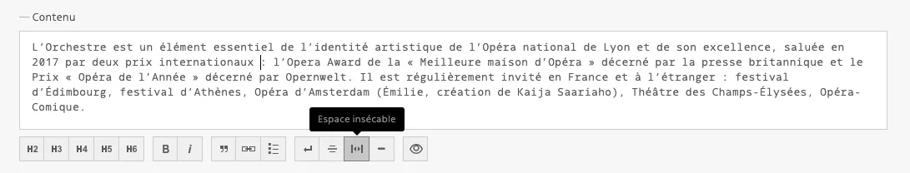

## **Listes ordonnées et non-ordonnées**

Insérez une étoile `*` ou un tiret `-` suivi d’un espace pour chaque élément de la liste. Un élément par ligne. Laissez une ligne vide avant et après la liste. Pour les listes *ordonnées*, utilisez un chiffre suivi d’un point et d’un espace.

```markdown
- ceci est une liste à puces
- ceci est une liste à puces
- ceci est une liste à puces
```

```markdown
* ceci est une liste à puces
* ceci est une liste à puces
* ceci est une liste à puces
```

```markdown
1. ceci est une liste à puces
2. ceci est une liste à puces
3. ceci est une liste à puces
```

Si vous avez besoin de retourner à la ligne au sein d’un seul élément, vous devrez utiliser la syntaxe du retour-chariot.

Votre back-office dispose d’un bouton qui vous permet d’insérer la syntaxe markdown d’une liste non-ordonnée en un seul clic :

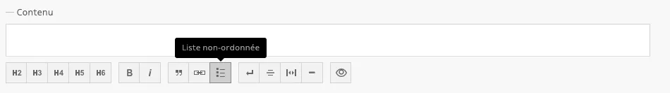

## **Liste imbriquée**

Vous pouvez insérer un deuxième, troisième, etc. niveau à votre liste en laissant quatre espaces avant chaque nouvel élément de liste.

```markdown
- ceci est niveau principal
    - ceci est le deuxième niveau
        - ceci est le troisième niveau
```

::: tip
💡 N’oubliez pas l’espace entre le tiret et le début du texte, sinon la liste à puce ne s’activera pas.
:::

Pour créer un nouveau paragraphe, laissez toujours une ligne vide entre vos blocs de texte. Toute ligne vide en plus sera ignorée.

## **Citations**

Insérez le signe `>` et un espace avant chaque nouveau paragraphe pour inclure votre texte dans une citation. Vous pourrez alors utiliser les autres symboles Markdown à l’intérieur de votre citation.

```markdown
> Lorem ipsum dolor sit amet, consectetur adipiscing elit.
```

Votre back-office dispose d’un bouton qui vous permet d’insérer la syntaxe markdown d’une citation en un seul clic :

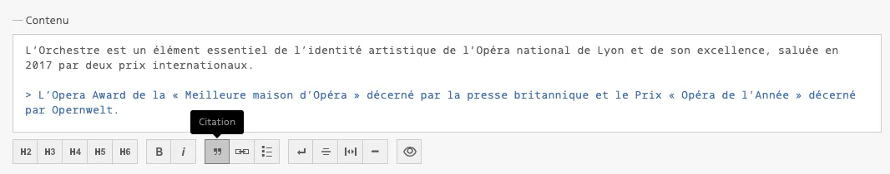

## Tiret insécable

Votre back-office dispose d’un bouton qui vous permet d’insérer la syntaxe markdown d’un tiret insécable en un seul clic :

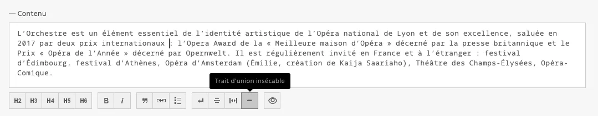

## **Titres**

Ajoutez deux dièses `#` ou plus en fonction de l’importance du titre souhaitée.

```markdown
## Ceci est un titre H2

### Ceci est un titre H3

#### Ceci est un titre H4
```

::: tip
⚠️ Attention à ne pas utiliser une seule dièse pour créer un titre de niveau 1, car il est généralement réservé au titre principal de votre page.
:::

Les boutons du back-office permettent d’insérer directement les dièses avant le texte sélectionné. Veillez à bien laisser un espace vide avant chaque nouveau titre.

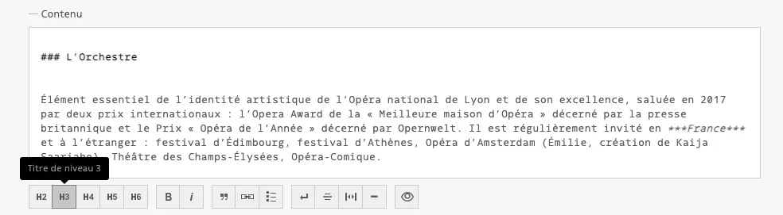

## Exposant et indice

### Exposant

Pour afficher un exposant, il est nécessaire de le renseigner entre deux balises `<sup></sup>` sans espaces.

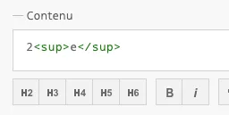

Exemple : pour afficher 2ᵉ, remplissez `2**<sup>e</sup>**`

### Indice

Pour afficher un indice, il est nécessaire de le renseigner entre deux balises `<sub></sub>` sans espaces.

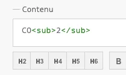

Exemple : pour afficher CO₂, remplissez `CO**<sub>2</sub>**`

## Image

### **Image interne**

Si votre image est téléversée dans le back-office, elle possède une URL propre (commence par `/files`). Pour la retrouver, il s’agit de l’onglet Édition de votre image, champ URL publique :

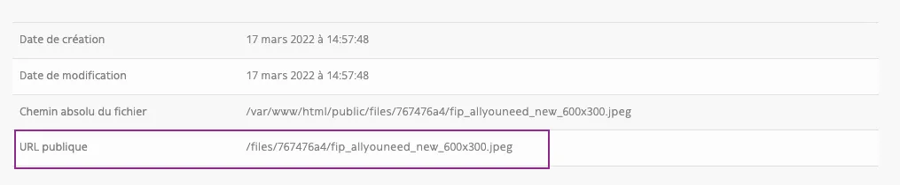

Syntaxe : ``

Le nom du fichier ne s’affichera pas en front.

Exemple :

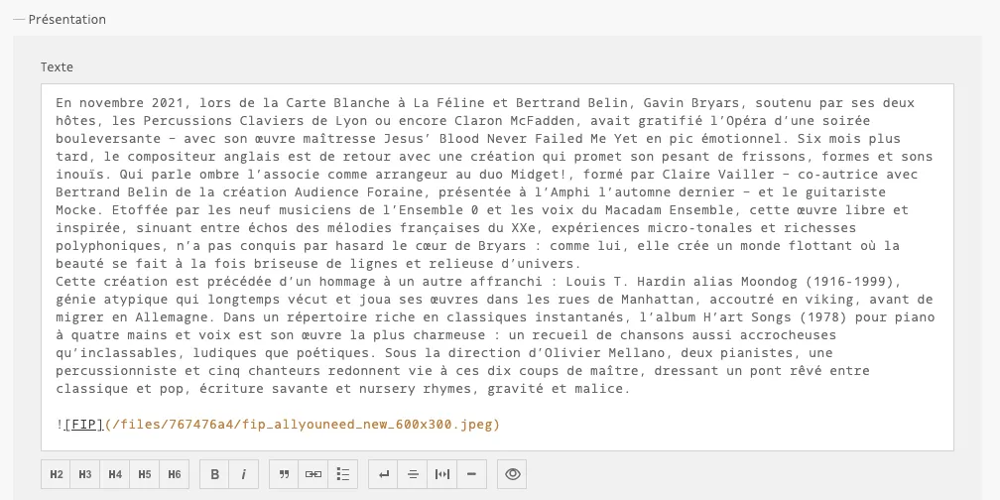

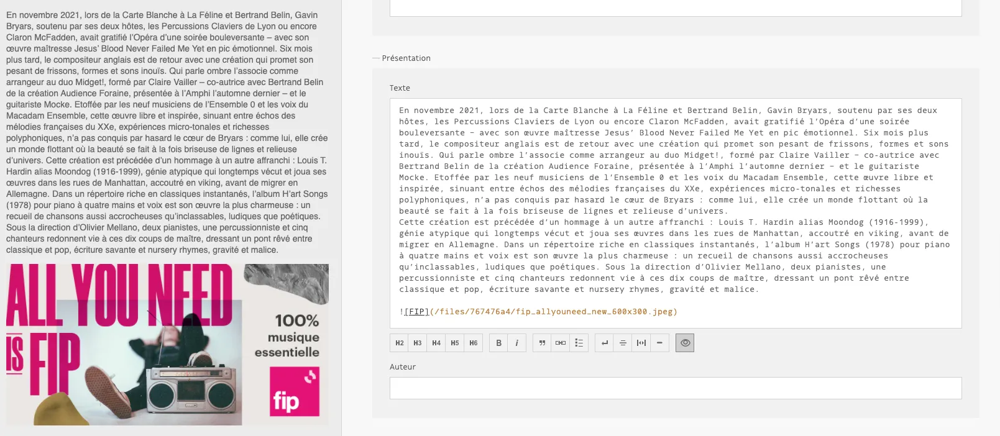

### **Image externe**

Pour pouvoir afficher une image hébergée sur un site externe, vous devez renseigner l’URL qui mène vers l’image en question dans la syntaxe Markdown :

``

### Image avec lien (image cliquable)

Pour rendre une image cliquable, il est nécessaire de l’envelopper avec la syntaxe d’un lien hypertexte.

## Prévisualisation

Pour vous assurer que votre syntaxe Markdown est bien appliquée, votre back-office vous propose un bouton en forme d’œil qui ouvre l’aperçu du Markdown :

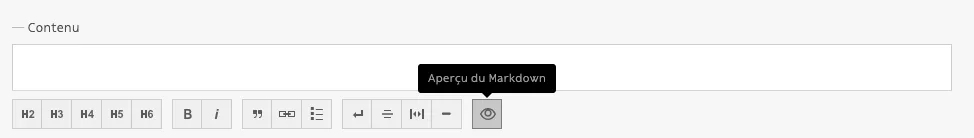

## Désactiver le Markdown

::: tip
📌 Si vous souhaitez faire apparaître dans votre texte certains caractères utilisés par Markdown, comme `*`, `+` ou `-`, il suffit d’échapper le caractère : rajoutez le symbole `\` devant le caractère que vous souhaitez faire apparaître.
:::

Exemples

Markdown activé :

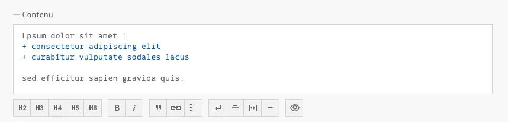

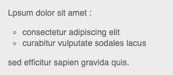

Markdown désactivé :

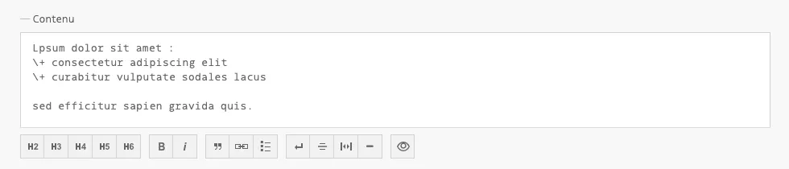

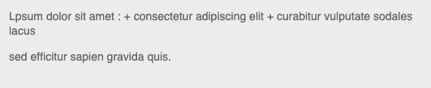
