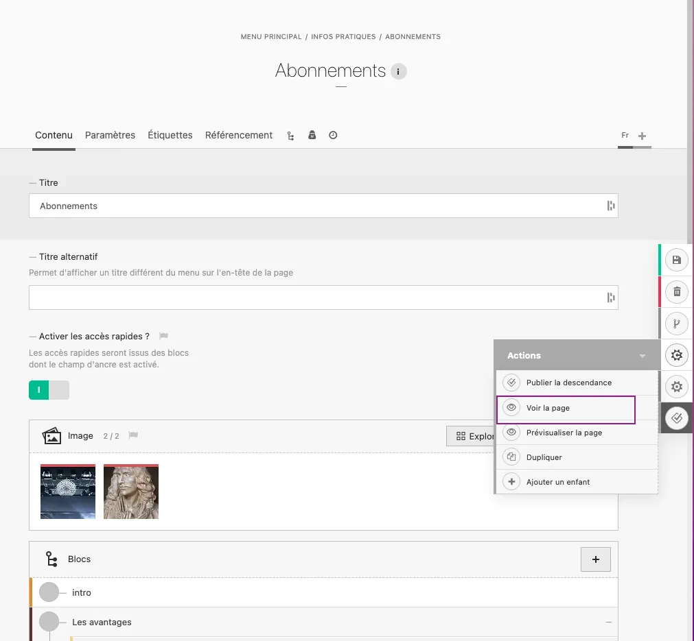
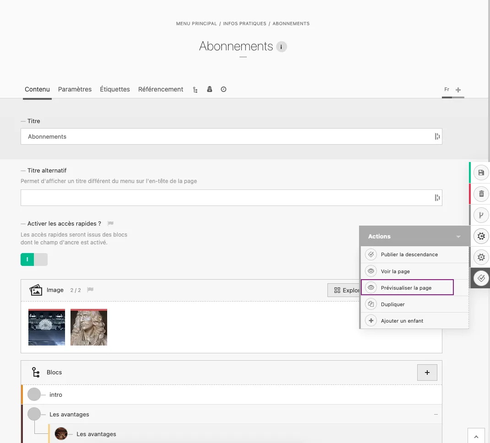

# Visualisation et Prévisualisation

# Introduction

Les fonctionnalités de visualisation et prévisualisation de pages sont disponibles uniquement aux utilisateurs du back-office connectés. Avant de pouvoir accéder à ces deux items, connectez-vous à votre comte utilisateur du CMS.

::: tip
Pour constater les changements opérés côté back-office, n’oubliez-pas de :
- **sauvegarder** vos modifications
- **rafraîchir** la page sur votre navigateur
:::

# Pages éditoriales

::: warning
💡 Attention, ces fonctionnalités sont disponibles uniquement si vous vous trouvez à la racine de la page ; si vous vous placez à l’intérieur d’un bloc, cette fonctionnalité ne sera pas disponible.
:::

<video controls>
<source src="/user/visualisation_et_previsualisation/Enregistrement_de_lecran_2024-08-27_a_12.37.37.webm" type="video/webm">
Your browser does not support the video tag.
</video>

## Visualisation

Pour visualiser les contenus **publiés** (ce que voient les utilisateurs du site), cliquez sur le bouton “Voir la page” de votre menu d’actions :

## Prévisualisation

Pour visualiser tout type de contenus de la page (**publiés et non-publiés/en brouillon**), cliquez sur “Prévisualiser la page” de votre menu d’actions :

::: warning
💡 Attention : les blocs et les pages dont le statut est **caché** ne sont pas visibles (ni en visualisation, ni en prévisualisation)
:::
