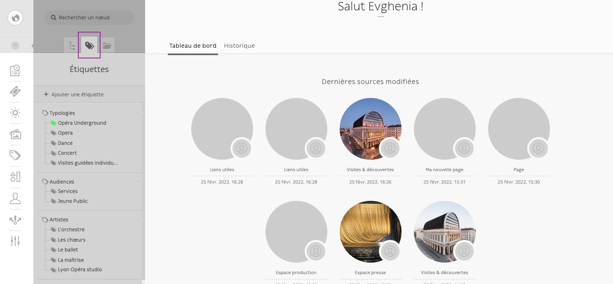
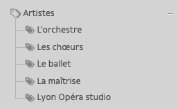

# Étiquettes

Certains nœuds (pages ou blocs) sont gérés via des tags (étiquettes).

L’accès aux étiquettes se fait par l’onglet correspondant :

On distingue des étiquettes parent et des étiquettes enfant

Tuto création d’étiquette parent :

[Enregistrement de l’écran 2022-02-25 à 16.39.06.mov](Étiquettes/Enregistrement_de_lecran_2022-02-25_a_16.39.06.mov)

Tuto création étiquette enfant :

[Enregistrement de l’écran 2022-02-25 à 16.40.22.mov](Étiquettes/Enregistrement_de_lecran_2022-02-25_a_16.40.22.mov)

Tuto d’attribution d’étiquette à un nœud et suppression :

[Enregistrement de l’écran 2022-02-25 à 16.43.36.mov](Étiquettes/Enregistrement_de_lecran_2022-02-25_a_16.43.36.mov)
